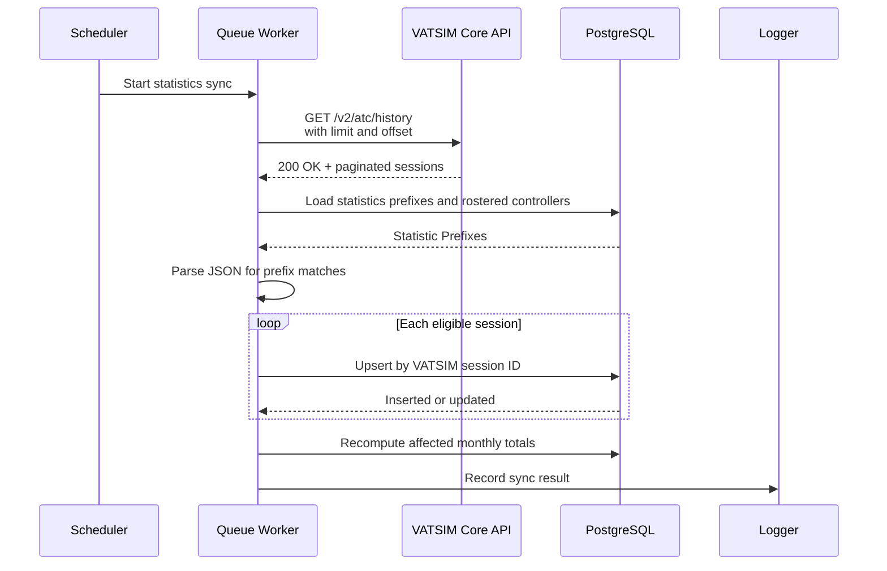

# ADR: VATSIM Statistics Synchronization

## Context

The subdivision needs two different views of controller activity:

1. Who is online now.
2. Historical activity used for roster and activity decisions.

The live view is transient; historical activity must survive application and worker downtime.

The application already maintains both paths. Live controllers are refreshed from VATSIM every minute. Historical sessions are currently imported from StatSim, stored in `controller_sessions`, and summarized into monthly statistics. StatSim availability has made it unsuitable for activity decisions.

VATSIM's Core API provides historical ATC sessions, so it will become the upstream source for historical activity.

## Decision

The system keeps two independent paths: the VATSIM live feed provides current online presence, while the VATSIM Core API provides eligible historical statistics.

### Live online sync

The existing live sync is unchanged. Every minute it retrieves VATSIM's online-controller feed, filters callsigns by the configured statistics prefixes, and rebuilds `online_controllers`.

This answers **who is online right now?** A failed run may leave the display stale, but it does not affect historical statistics.

### Historical statistics sync

A separate queued job will run every six hours and synchronize historical ATC sessions from the VATSIM Core API.

The VATSIM history endpoint accepts a UTC date range and is paginated (`limit` and `offset`). The client will request an overlapping lookback period, read every returned page, and apply the cutoff locally using the session start time.

For every returned session, the job will:

1. Read the VATSIM session identity from `connection_id.id` and map the Core payload to the existing session fields.
2. Apply the existing eligibility rules: callsign prefix, currently rostered controller, and a recognised controller position (`DEL`, `GND`, `TWR`, `APP`/`DEP`, `CTR`/`FSS`).
3. Upsert the eligible session and recompute the affected controller-month totals.
4. Log the run outcome, including pages read, accepted and skipped sessions, and any failure.

The Core connection identifier is stored as `controller_sessions.id`. Before the initial Core backfill, legacy StatSim session rows must be cleared so their IDs cannot collide.

VATSIM is authoritative for raw session data. The local statistics report only sessions that satisfy the subdivision's eligibility rules.

### Idempotency and recovery

`controller_sessions.id` is a primary key, and the existing importer already uses an upsert. Once the VATSIM Core identifier is mapped to that key, processing a session again updates or retains the existing row rather than creating a duplicate.

An overlapping lookback is therefore safe. It lets a later successful run recover sessions missed during a failed run or application downtime, provided the downtime is within VATSIM's available history and the configured recovery window.

Monthly statistics continue to be derived from the stored sessions. Sessions are counted in the month of their start time; timestamps and month boundaries are handled in UTC. If an upsert changes a session, the implementation must recompute every affected month.

## Historical Sync Sequence

## Alternatives

### Continue using StatSim

Rejected. Its availability makes it an unreliable dependency for roster activity decisions.

### Build history from the live feed

Rejected. This would require the application to observe every session continuously, so downtime could permanently miss activity.

### Synchronize directly from VATSIM Core

Selected. It retains the existing storage and reporting pipeline while replacing StatSim with the authoritative session source.

## Consequences

The system keeps two independent paths:

**VATSIM live feed → current online presence**

**VATSIM Core API → eligible historical statistics**

Implementation replaces the StatSim client, scheduled job, manual sync entry points, configuration, and tests. The session storage and reporting model remain in place unless Core and StatSim session identifiers are incompatible.

The Laravel scheduler and queue worker must be running for either sync to execute. The six-hour interval and lookback may be adjusted after VATSIM endpoint behavior and operational constraints are verified.
