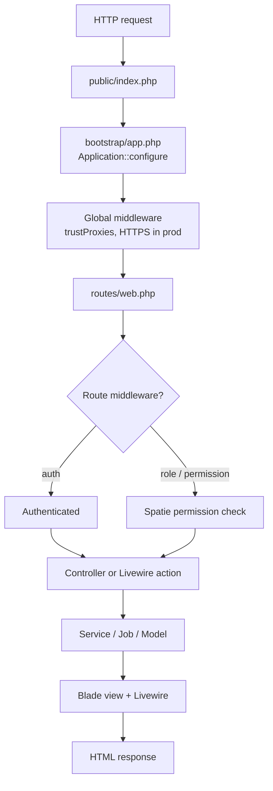

# Architecture overview

This document is a map of the ZJX ARTCC website for developers and contributors. It
covers the stack, how a request flows through the app, where code lives, how routing and
scheduled work are wired up, and which infrastructure drivers the app relies on. Read this
first, then jump to the focused system docs linked in the [Systems index](#systems-index).

## The stack

The site is a VATSIM ARTCC web app built on a conventional server-rendered Laravel stack.

| Layer | Technology | Notes |
| --- | --- | --- |
| Framework | Laravel 12 (`laravel/framework: ^12.0`) | PHP `^8.2`. Uses the streamlined `bootstrap/app.php` application-configuration style. |
| Interactivity | Livewire (class-based) | Components live in `app/Livewire/` and extend `Livewire\Component`. `livewire/volt` is installed and `VoltServiceProvider` mounts the Volt view paths, but no single-file Volt components are used — every component is a class with a matching Blade view under `resources/views/livewire/`. |
| Styling | Tailwind CSS v4 + daisyUI 5 | Configured entirely in CSS (`resources/css/app.css`), not a JS config file. Uses a single custom daisyUI theme named `light`. |
| Build tool | Vite | Config in `vite.config.js` via `laravel-vite-plugin` and `@tailwindcss/vite`. Entry points are `resources/css/app.css` and `resources/js/app.js`. |
| Auth | Laravel Socialite (VATSIM Connect) | Custom Socialite provider; see [authentication](authentication-authorization.md). |
| Authorization | `spatie/laravel-permission` | Roles and permissions, enforced with middleware aliases. |
| Audit logging | `spatie/laravel-activitylog` | See [audit logging](systems/audit-logging.md). |
| Search | Laravel Scout | Uses the default `collection` driver (see [Infrastructure drivers](#infrastructure-drivers)). |
| Testing | Pest 4 (`pestphp/pest: ^4.1`) | With `pest-plugin-laravel` and `pest-plugin-stressless`. |

There is no SPA/front-end framework and no Inertia in active use — pages are Blade views
enhanced with Livewire components where interactivity is needed. (A `dev:ssr` Composer
script mentions Inertia SSR, but Inertia is not a dependency and the app does not use it.)

## Request lifecycle

Requests are wired up in `bootstrap/app.php`, which registers the web routes, the console
schedule, and the `/up` health check. There is a single web route file and no API route
file.

Key points about the pipeline:

- **Entry point** is the standard `public/index.php`, which boots the app configured in
  `bootstrap/app.php`.
- **Proxy trust** is configured globally: the app trusts all upstream proxies for the
  `X-Forwarded-*` headers so the correct scheme, host, and port are honored behind a load
  balancer.
- **HTTPS** is force-enabled in the `production` environment (`AppServiceProvider::boot`).
- **Outbound HTTP** is pinned to IPv4 globally (`Http::globalOptions(['force_ip_resolve' => 'v4'])`)
  in `AppServiceProvider::boot`, which matters for the VATSIM/VATUSA API calls described in
  [VATSIM integration](vatsim-integration.md).
- **The VATSIM Socialite provider** is registered in `AppServiceProvider::boot` via
  `$socialite->extend('vatsim', ...)`.

There are **no custom middleware classes** — the `app/Http/Middleware` directory does not
exist. The only route middleware in use are Laravel's built-in `auth` and the three Spatie
permission aliases described under [Routing](#routing).

## Directory layout

Application code lives under `app/`. The most important directories:

| Directory | Purpose |
| --- | --- |
| `app/DTOs/` | Plain data objects for external API payloads and internal transfer — e.g. `OnlineControllerDTO`, `VatusaRosterUser`, `VatusaFacilityInfoDTO`, `VatusaRole`, `VisitingChecklistDTO`. |
| `app/Enums/` | PHP enums: `ControllerRating`, `EventType`, `TrainingStatus`, `TrainingType`, `VisitRequestStatus`. |
| `app/Jobs/` | Queued jobs: `SyncRoster`, `UpdateOnlineControllers`, `SyncTrainingTickets`, `AddUserToVisitingRoster`, `CreateVatusaSoloCert`, `RevokeVatusaSoloCert`, `SendTrainingRequestToWebhook`. |
| `app/Livewire/` | Class-based Livewire components (e.g. `EventTable`, `UserTable`, `TrainingAssignmentsTable`, `CreateEvent`, `EventRegistration`). Their Blade templates live in `resources/views/livewire/`. |
| `app/Mail/` | Mailables: `Welcome`, training and solo-cert notifications, and visitor-request notifications. |
| `app/Models/` | Eloquent models: `User`, `Event`, `EventPosition`, `TrainingTicket`, `TrainingAssignment`, `SoloCert`, `VisitorRequest`, `CertificationFacility`, `CertificationLevel`, `UserCertification`, `OnlineController`, `Staff`, and others. |
| `app/Services/` | Domain services — `VisitingChecklistService` and the `Socialite/VatsimProvider` custom OAuth provider. |
| `app/View/` | Blade view components (`app/View/Components/`) such as `Card`, `NavLinks`, `OnlineController`, and various training/solo-cert table components. |
| `app/Http/Controllers/` | Standard controllers, grouped into `Auth/` and `Training/` subnamespaces. |
| `app/Providers/` | `AppServiceProvider` and `VoltServiceProvider`, both registered in `bootstrap/providers.php`. |

Blade views live under `resources/views/`, with page layouts in `resources/views/layouts/`:

- `main.blade.php` — the public/site layout.
- `admin.blade.php` — the admin panel layout.
- `profile.blade.php` — the user-profile layout.

## Routing

**All routing is defined in `routes/web.php`.** There is no `routes/api.php`. Routes are
registered in `bootstrap/app.php` with `web:` and `commands:` only.

Authorization on routes uses three middleware aliases registered in `bootstrap/app.php`,
all backed by `spatie/laravel-permission`:

| Alias | Class |
| --- | --- |
| `role` | `Spatie\Permission\Middleware\RoleMiddleware` |
| `permission` | `Spatie\Permission\Middleware\PermissionMiddleware` |
| `role_or_permission` | `Spatie\Permission\Middleware\RoleOrPermissionMiddleware` |

Routing structure at a glance:

- **Public routes**: home (`/`), roster (`/roster`), staff directory (`/staff`), events
  (`/events`, `/events/{event}`), visiting-facility landing (`/visit`), and user profiles
  (`/users/{user}` and its sub-pages).
- **Auth flow**: `/auth/redirect`, `/auth/callback`, `/auth/logout`, and a `/login`
  redirect. See [authentication](authentication-authorization.md).
- **`auth`-guarded actions**: visiting-controller requests (`/visit/create`, `/visit`),
  event position requests, and training-assignment creation.
- **Admin area** (`/admin`, gated by `permission:view dashboard`): the dashboard plus
  nested groups each with their own permission or role gate — user management, visiting
  controllers (`permission:manage visiting controllers`), facilities data
  (`permission:manage statistics prefixes`, `permission:manage certification facilities`),
  audit logs (`permission:view audit logs`), training (`role:training`), and events
  (`permission:manage events`).
- **Dev-only routes**: `/sync`, `/sync-training`, and `/test-email` are registered only
  in the `local` and `development` environments for manually dispatching jobs and previewing
  mail.

## Scheduled work

The scheduler is defined in `routes/console.php` (the console entry registered by
`bootstrap/app.php`):

| Schedule | Job | Frequency |
| --- | --- | --- |
| `Schedule::job(new SyncRoster())` | `app/Jobs/SyncRoster.php` | Every two hours |
| `Schedule::job(new UpdateOnlineControllers())` | `app/Jobs/UpdateOnlineControllers.php` | Every minute |

`SyncRoster` pulls the controller roster from VATUSA; `UpdateOnlineControllers` refreshes
who is currently online. Both are covered in [VATSIM integration](vatsim-integration.md)
and [roster and membership](systems/roster-and-membership.md). In local/development you can
trigger these manually via the dev-only `/sync` route.

Because scheduled work is dispatched as queued jobs, a queue worker and the scheduler both
need to run. `composer run dev` starts `php artisan serve`, `php artisan queue:listen`,
`php artisan pail`, and `npm run dev` together for local development.

## Infrastructure drivers

The app is deliberately dependency-light — there is **no Redis**. Everything runs on the
database and the filesystem:

| Concern | Driver | Source |
| --- | --- | --- |
| Queue | `database` | `config/queue.php` (`QUEUE_CONNECTION`) |
| Cache | `database` | `config/cache.php` (`CACHE_STORE`) |
| Session | `database` | `config/session.php` (`SESSION_DRIVER`) |
| Search | `collection` | Laravel Scout default (`SCOUT_DRIVER`); no `config/scout.php` is published |
| Database | PostgreSQL (`pgsql`) | `config/database.php` (`DB_CONNECTION`); `.env.example` defaults to `pgsql` |

Laravel Scout runs on the default **`collection`** driver, which performs searches directly
against the database in PHP — there is no Algolia, Meilisearch, or other external search
service. Models using search (`User`, `TrainingTicket`, `TrainingAssignment`, `SoloCert`,
`VisitorRequest`) apply Scout's `Searchable` trait. See [database](database.md) for schema
details.

The default queue, cache, and session all live in PostgreSQL, so a standard deployment
needs only PHP, PostgreSQL, and a queue worker plus scheduler. See [deployment](deployment.md).

## Systems index

Each subsystem has its own document. Start here and follow the links:

| Document | What it covers |
| --- | --- |
| [authentication-authorization.md](authentication-authorization.md) | VATSIM Connect OAuth login, the custom Socialite provider, and Spatie roles/permissions. |
| [database.md](database.md) | Schema, tables, migrations, and model relationships. |
| [vatsim-integration.md](vatsim-integration.md) | VATSIM/VATUSA API integration, sync jobs, and DTOs. |
| [deployment.md](deployment.md) | Deploying and operating the app (queue worker, scheduler, drivers). |
| [systems/roster-and-membership.md](systems/roster-and-membership.md) | Controller roster sync, membership, and online-controller tracking. |
| [systems/training.md](systems/training.md) | Training tickets, assignments, and solo certifications. |
| [systems/events.md](systems/events.md) | Events, position presets, event fields, and registration. |
| [systems/visiting-controllers.md](systems/visiting-controllers.md) | Visiting-controller requests and approval workflow. |
| [systems/certifications.md](systems/certifications.md) | Certification facilities, levels, and user certifications. |
| [systems/users-and-profiles.md](systems/users-and-profiles.md) | User accounts, profiles, and staff directory. |
| [systems/audit-logging.md](systems/audit-logging.md) | Activity logging with `spatie/laravel-activitylog`. |
| [discrepancies.md](discrepancies.md) | Known inconsistencies, dead code, and follow-ups found while documenting. |
