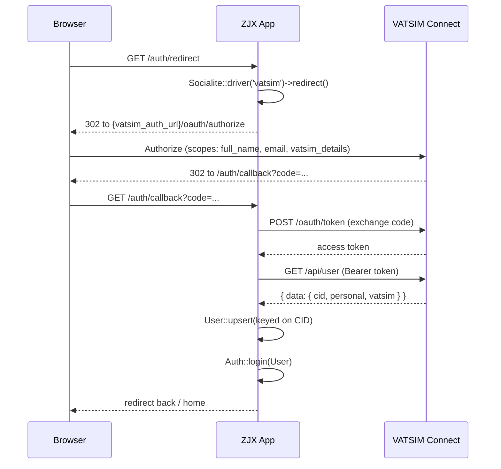

# Authentication & Authorization

This document explains how users sign in to the ZJX ARTCC site and how the app decides what each user is allowed to do. Authentication is delegated entirely to VATSIM Connect (OAuth2). Authorization is handled with roles and permissions from `spatie/laravel-permission`.

## Authentication

### There are no passwords

The site never collects, stores, or verifies a password. The only way to authenticate is through VATSIM Connect. The `users` table does carry `password` / `remember_token` columns (inherited from the default Laravel schema and cast/hidden in `app/Models/User.php`), but nothing sets them — there is no registration form, no password reset, and no local login form.

The user's primary key is their VATSIM CID. When a user authenticates, the app upserts the `users` row keyed on that CID and logs them in.

### The moving parts

| Concern | Where it lives |
| --- | --- |
| Routes | `routes/web.php` (`/auth/redirect`, `/auth/callback`, `/auth/logout`, `/login`) |
| Controller | `app/Http/Controllers/Auth/VatsimOauthController.php` |
| Custom Socialite provider | `app/Services/Socialite/VatsimProvider.php` |
| Provider registration | `app/Providers/AppServiceProvider.php` |
| OAuth credentials | `config/services.php` (`vatsim` block) |
| VATSIM endpoint base URL | `config/app.php` (`vatsim_auth_url`) |
| Guard / user provider | `config/auth.php` |
| Session storage | `config/session.php` |

### Session and guard configuration

- The default guard is `web` (`config/auth.php`, overridable via `AUTH_GUARD`). It uses the `session` driver with the `users` provider.
- The `users` provider is `eloquent`, backed by `App\Models\User`.
- Sessions are stored with the `database` driver by default (`config/session.php`, overridable via `SESSION_DRIVER`), in the `sessions` table.

So a logged-in user is a normal session-backed Laravel auth session; there are no API tokens involved in the browser login flow.

### OAuth credentials

`config/services.php` defines the `vatsim` block that Socialite reads:

```
'vatsim' => [
    'client_id' => env('VATSIM_CLIENT_ID'),
    'client_secret' => env('VATSIM_CLIENT_SECRET'),
    'redirect' => env('APP_URL', 'invalid_config').'/auth/callback',
],
```

The redirect URI is derived from `APP_URL` and must match `/auth/callback`. The VATSIM Connect base URL comes separately from `config('app.vatsim_auth_url')` (env `VATSIM_AUTH_URL`), read inside the custom provider — not from the `services.vatsim` block.

### The custom Socialite provider

`app/Services/Socialite/VatsimProvider.php` extends `Laravel\Socialite\Two\AbstractProvider`. It exists because VATSIM Connect is a bespoke OAuth2 server with its own endpoints and response shape.

Key points:

- **Scopes:** `full_name`, `email`, `vatsim_details`, joined by a single space.
- **Endpoints**, all built from `config('app.vatsim_auth_url')`:
  - Authorize: `{base}/oauth/authorize`
  - Token: `{base}/oauth/token`
  - User info: `{base}/api/user` (called with `Authorization: Bearer <token>`)
- **Response shape:** VATSIM wraps the user payload inside a top-level `data` key, so `mapUserToObject()` reads `$user["data"]` before mapping fields.
- **Field mapping** into the Socialite user object:
  - `cid` ← `data.cid`
  - `first_name` ← `data.personal.name_first`
  - `last_name` ← `data.personal.name_last`
  - `email` ← `data.personal.email`
  - `rating` ← `data.vatsim.rating.id`
  - `division` ← `data.vatsim.division.id`
  - `facility` ← `data.vatsim.subdivision.id`

The provider only builds an in-memory object. It does **not** write to the database — that happens in the controller.

### Provider registration

`app/Providers/AppServiceProvider.php` registers the driver under the name `vatsim` in `boot()`:

```php
$socialite = $this->app->make('Laravel\Socialite\Contracts\Factory');

$socialite->extend('vatsim', function ($app) use ($socialite) {
    $config = $app['config']['services.vatsim'];
    return $socialite->buildProvider(VatsimProvider::class, $config);
});
```

This is why `Socialite::driver('vatsim')` resolves to `VatsimProvider`. The same provider also forces the HTTPS scheme in production and pins outbound HTTP to IPv4.

### The controller

`app/Http/Controllers/Auth/VatsimOauthController.php` has three actions:

- **`redirect()`** — `Socialite::driver('vatsim')->redirect()` sends the user to VATSIM Connect.
- **`callback()`** — pulls the mapped user with `Socialite::driver('vatsim')->user()`, then upserts the `users` row keyed on `id` (the CID). It maps `first_name`, `last_name`, `email`, `division`, `facility`, and `rating`. `facility` falls back to the existing stored value when VATSIM does not return one. Finally it calls `Auth::login(User::find($user->cid))` and redirects back (falling back to the `home` route).
- **`logout()`** — `Auth::logout()` and redirect back (falling back to `home`).

Note that creating a brand-new `users` row here triggers the model's `created` hook, which assigns the default `core` role (see Authorization below).

### Routes

Defined in `routes/web.php`:

| Method | Path | Name | Action |
| --- | --- | --- | --- |
| GET | `/auth/redirect` | `auth.redirect` | `VatsimOauthController@redirect` |
| GET | `/auth/callback` | `auth.callback` | `VatsimOauthController@callback` |
| GET | `/auth/logout` | `auth.logout` | `VatsimOauthController@logout` |
| GET | `/login` | `login` | Redirects to `auth.redirect` |

The `/login` route exists so Laravel's `auth` middleware (which redirects guests to the `login` named route) lands users on the VATSIM redirect instead of a login form.

### OAuth flow



## Authorization

Authorization uses `spatie/laravel-permission`. The `User` model uses the `HasRoles` trait (`app/Models/User.php`). Everything is expressed as **roles** that own **permissions**; the app checks either roles or permissions depending on the call site.

### Role → permission matrix

Seeded by `database/seeders/PermissionSeeder.php`. These are the canonical role and permission names — match them exactly in code and Blade.

| Role | Permissions |
| --- | --- |
| `core` | `edit own profile` |
| `staff` | `view dashboard` |
| `admin` | `manage users`, `assign roles`, `manage roles`, `view audit logs`, `manage visiting controllers` |
| `events` | `manage events`, `assign event positions`, `publish events` |
| `facilities` | `manage statistics prefixes`, `manage certification facilities` |
| `training` | `create training tickets`, `edit training tickets`, `claim students`, `issue solo certs` |
| `instructor` | `revoke solo certs`, `manage training tickets`, `manage students` |

The seeder creates each role, creates each permission, and grants the permission to its role via `firstOrCreate` + `givePermissionTo`, so it is idempotent.

### How roles get assigned

There are two assignment paths.

**1. Default `core` role on user creation.** `app/Models/User.php` `booted()` hook:

```php
static::created(function ($user) {
    $user->assignRole('core'); // default role
});
```

Every newly created user — including one created during OAuth callback — gets `core`. Because `core` is assigned on the `created` event (not on updates), a user upserted for the first time gets it; subsequent upserts of an existing user do not re-run this.

**2. VATUSA staff titles → roles during roster sync.** `app/Jobs/SyncRoster.php` maps VATSIM/VATUSA facility staff positions to roles. During `updateStaffMembers()` the job first calls `clearUserRoles()`, then rebuilds the `Staff` table, then calls `assignRoles()`. So staff roles are **fully recomputed on every sync**.

- `clearUserRoles()` removes `staff`, `admin`, `training`, `events`, `facilities`, and `instructor` from every user. It does **not** remove `core`, so the base role survives a sync.
- `assignRoles()` iterates `Staff` records and maps `title_short` to roles:

| Title code | Roles assigned |
| --- | --- |
| `ATM` | `admin`, `training`, `instructor`, `facilities`, `events`, `staff` |
| `DATM` | `admin`, `training`, `instructor`, `facilities`, `events`, `staff` |
| `TA` | `admin`, `training`, `staff` |
| `ATA` | `admin`, `training`, `staff` |
| `WM` | `admin`, `training`, `instructor`, `facilities`, `events`, `staff` |
| `EC` | `events`, `staff` |
| `FE` | `facilities`, `staff` |
| `INS` | `instructor`, `training`, `staff` |
| `MTR` | `training`, `staff` |

(ATM = Air Traffic Manager, DATM = Deputy ATM, TA = Training Administrator, ATA = Assistant TA, WM = Webmaster, EC = Events Coordinator, FE = Facilities Engineer, INS = Instructor, MTR = Mentor.)

Additionally, when running in the `development` environment, `SyncRoster::handle()` grants any user whose first name is "Web" the full set `admin`, `staff`, `training`, `events`, `facilities`, `instructor` and marks them rostered — this is a local test-account convenience, not production behavior.

### Route middleware map

Roles and permissions are enforced on routes via middleware aliases registered in `bootstrap/app.php`:

```php
'role' => Spatie\Permission\Middleware\RoleMiddleware::class,
'permission' => Spatie\Permission\Middleware\PermissionMiddleware::class,
'role_or_permission' => Spatie\Permission\Middleware\RoleOrPermissionMiddleware::class,
```

`routes/web.php` uses them like this:

| Route group / route | Middleware | Effect |
| --- | --- | --- |
| `admin/*` (whole group) | `permission:view dashboard` | Requires the `view dashboard` permission (owned by `staff`). Gates the admin dashboard and everything nested below. |
| `admin/users` | (inherits group only) | Only needs `view dashboard`. |
| `admin/visit-requests*` | `permission:manage visiting controllers` | Visiting-controller request management (owned by `admin`). |
| `admin/data/statistics-prefixes` | `permission:manage statistics prefixes` | Statistics prefix CRUD (owned by `facilities`). |
| `admin/data/certification-facilities*` | `permission:manage certification facilities` | Certification facility/level management (owned by `facilities`). |
| `admin/logs*` | `permission:view audit logs` | Audit log view/export (owned by `admin`). |
| `admin/training/*` | `role:training` | Training tickets, assignments, solo certs. Note this checks the **`training` role**, not a permission. |
| `admin/events/*` | `permission:manage events` | Event management, event fields, position presets (owned by `events`). |

Routes outside the admin group that require only a logged-in user use plain `auth`: `visit.create`, `visit.store`, `training-assignment.create`, and `events.request-position.store`.

The `/sync`, `/sync-training`, and `/test-email` helper routes are only registered in `development` / `local` environments and have no auth middleware.

### No Policies, no Gates

This codebase has **no** authorization Policies and **no** `Gate::define` calls. There is no `app/Policies` directory, and `Gate::` does not appear in `app/`. All authorization is either:

1. Route middleware (`role:` / `permission:` as above), or
2. **Inline checks scattered through controllers and Blade views** using `hasRole(...)` / `hasPermissionTo(...)`.

Because there is no central Policy layer, fine-grained rules live at each call site. Notable inline checks:

- `app/Http/Controllers/UserController.php` — gates profile edit/update on `manage users` (or the user editing their own profile), and only lets holders of `manage users` set operating initials.
- `app/Http/Controllers/Training/TrainingAssignmentController.php` — checks `manage students` and `claim students` for creating, claiming, dropping, and destroying assignments.
- `app/Http/Controllers/Training/SoloCertController.php` — checks `revoke solo certs` before revocation.

Blade views also branch on roles/permissions to show or hide UI (for example `resources/views/components/admin-navbar.blade.php`, `resources/views/components/nav-links.blade.php`, `resources/views/admin/index.blade.php`, and several training views). Treat these Blade checks as presentation-only; the authoritative enforcement is the route middleware plus the controller-level checks above.

### Practical implications for contributors

- When you add an admin feature, put it under the `admin` prefix and attach the narrowest `permission:` (or `role:`) middleware that fits. Do not rely on hiding a link in Blade for security.
- If you introduce a new capability, add its permission to `database/seeders/PermissionSeeder.php` and grant it to the appropriate role(s), then reference that exact permission string in middleware and inline checks.
- Remember that roster sync wipes and rebuilds staff roles every run. Do not manually assign `staff`, `admin`, `training`, `events`, `facilities`, or `instructor` and expect it to persist — drive those through VATUSA staff titles. Only `core` is durable across syncs.
