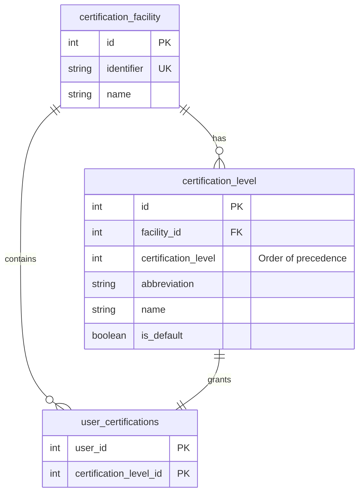

```mermaid
    erDiagram
        certification_facility ||--o{ certification_level : has
        certification_facility ||--o{ user_certifications : contains
        certification_level ||--|| user_certifications : grants
        
        certification_facility {
            int id PK
            string identifier UK
            string name
        }

        certification_level {
            int id PK
            int facility_id FK
            int certification_level "Order of precedence"
            string abbreviation
            string name
            boolean is_default
        }

        user_certifications {
            int user_id PK
            int certification_level_id PK
        }


```
