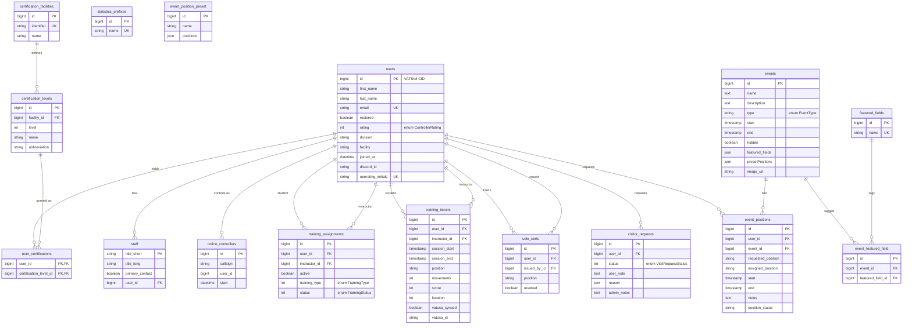

# Database

This document maps the ZJX ARTCC database for developers and contributors: which engines
run where, the schema table by table, how the app-domain tables relate, and how the
database is seeded and faked in development and tests. Everything here is verified against
the migrations under `database/migrations/` and the models under `app/Models/` — when a
model and a migration disagree, both are noted.

## Engines and connections

The default connection is **PostgreSQL**. `config/database.php` sets
`'default' => env('DB_CONNECTION', 'pgsql')`, and `.env.example` ships with
`DB_CONNECTION=pgsql`, `DB_HOST=db`, `DB_PORT=5432`, and `DB_DATABASE=zjx_website`. The
`pgsql` connection uses `search_path` `public` and `sslmode` `prefer`. This is the
connection you use for local development and in production.

Three connections are defined in `config/database.php`: `sqlite`, `pgsql`, and `sqlsrv`.
Only `pgsql` and `sqlite` are used in practice.

### Test databases (read this carefully — the two paths differ)

There are two ways the test suite gets a database, and they disagree on the engine:

- **Running `php artisan test` (or Pest) locally uses PostgreSQL.** `phpunit.xml` declares
  `<env name="DB_CONNECTION" value="pgsql"/>` and `<env name="DB_DATABASE" value="zjx_test"/>`.
  So a plain local run expects a Postgres database named `zjx_test` to exist. (Consistent
  with the auto-memory note: tests run on pgsql `zjx_test`.)

- **CI runs the suite on SQLite.** `tests/docker-compose.yml` sets container environment
  variables `DB_CONNECTION: sqlite` and `DB_DATABASE: /var/www/html/storage/database/database.sqlite`.
  Real environment variables take precedence over the `<env>` values in `phpunit.xml`, so
  inside that container the suite runs against SQLite regardless of what `phpunit.xml` says.

This is a genuine conflict: the same suite targets pgsql in a bare local run and SQLite in
the containerized CI run. Be aware which one you are in — schema behavior (enum columns,
JSON columns, foreign-key enforcement) can differ between the two engines. If you rely on
Postgres-specific behavior in a test, it may still pass on SQLite in CI, or vice versa.

## Schema

Tables fall into three groups: **application domain** tables (the bulk of this doc),
**Spatie package** tables (permissions, activity log), and **framework** tables (sessions,
cache, jobs). Column types below are the Laravel Blueprint types from the migrations.

Several `integer(...)` columns are declared with the extra Blueprint arguments
`integer($name, $autoIncrement, $unsigned)`; where relevant this is noted, but the app
treats these as plain integers cast to enums.

### users

Created in `0001_01_01_000000_create_users_table.php`, then extended by
`2025_10_30_150500_add_user_columns.php` and `2026_06_19_000001_widen_division_facility_on_users.php`.

The primary key is the member's **VATSIM CID**, stored as `id`. It is a normal
auto-increment `id()` column in the migration, but in practice the CID is assigned
explicitly on insert (see `UserSeeder`, `UserFactory`, and `User::updateFromVatusa`) rather
than auto-generated.

| Column | Type | Notes |
| --- | --- | --- |
| `id` | bigint PK | VATSIM CID |
| `first_name` | string | Title-cased via a model accessor/mutator |
| `last_name` | string | Title-cased via a model accessor/mutator |
| `email` | string, unique | |
| `rostered` | boolean, default `false` | Cast to boolean |
| `rating` | integer, default `1` | **Enum-cast to `App\Enums\ControllerRating`** |
| `division` | string(10), nullable | Widened from `string(3)` to fit codes like `MENA` |
| `facility` | string(10), nullable | Widened from `string(3)` |
| `joined_at` | datetime, nullable | Cast to datetime |
| `discord_id` | string, nullable | |
| `profile_image_route` | string, default `images/default_profile.jpg` | |
| `biography` | text, nullable | |
| `operating_initials` | string(2), nullable, unique | Upper-cased via a model accessor/mutator |
| `created_at` / `updated_at` | timestamps | |

`App\Models\User` casts `rating` to `ControllerRating`, `joined_at` to datetime, and
`rostered` to boolean. It also declares `password` (hashed) and `remember_token` as hidden
attributes, though no migration adds those columns.

Relationships (all defined on `User`): `staffRoles` (hasMany `Staff`),
`trainingAssignmentsAsStudent` / `trainingAssignmentsAsInstructor` (hasMany
`TrainingAssignment`), `trainingTicketsAsStudent` (hasMany `TrainingTicket`), `soloCerts`
(hasMany `SoloCert`), `visitRequests` (hasMany `VisitorRequest`), `certifications` (hasMany
`UserCertification`), and `events` (belongsToMany `Event` through `event_positions`).

### staff

`2025_11_04_042606_add_staff_table.php`. Maps a user to a staff title. The model
(`App\Models\Staff`) sets `primaryKey = 'title_short'` (string), `timestamps = false`.

| Column | Type | Notes |
| --- | --- | --- |
| `title_short` | string | e.g. `ATM`, `TA`, `INS` |
| `title_long` | string | e.g. `Air Traffic Manager` |
| `primary_contact` | boolean, default `false` | Cast to boolean |
| `user_id` | foreignId → `users` | |

### online_controllers

`2025_11_02_220134_add_online_controllers.php`. Snapshot of who is controlling online.
Model has `timestamps = false`.

| Column | Type | Notes |
| --- | --- | --- |
| `id` | bigint, auto-increment | |
| `callsign` | string | |
| `user_id` | foreignId | No DB-level FK constraint declared |
| `start` | datetime | |

### statistics_prefixes

`2025_11_02_222455_statistics_prefixes.php`. Callsign prefixes counted for controller
statistics. Model has `timestamps = false` and upper-cases `name`.

| Column | Type | Notes |
| --- | --- | --- |
| `id` | bigint PK | |
| `name` | string, unique | e.g. `JAX`, `MCO` |

### training_assignments

`2025_11_08_032750_add_training_assignment_table.php`. A student's assignment to an
instructor for a given training track.

| Column | Type | Notes |
| --- | --- | --- |
| `id` | bigint PK | |
| `user_id` | foreignId → `users`, cascade update/delete | The student |
| `instructor_id` | foreignId → `users`, nullable, cascade update/delete | |
| `active` | boolean, default `true` | Cast to boolean |
| `training_type` | integer (unsigned), default `0` | **Enum-cast to `App\Enums\TrainingType`** |
| `status` | integer (unsigned), default `1` | **Enum-cast to `App\Enums\TrainingStatus`** |
| `created_at` / `updated_at` | timestamps | |

Relationships: `student` and `instructor` (both belongsTo `User`).

### training_tickets

`2025_11_12_023402_create_training_tickets_table.php`, plus
`2026_06_11_000001_add_vatusa_id_to_training_tickets_table.php`. One training session
record.

| Column | Type | Notes |
| --- | --- | --- |
| `id` | bigint PK | |
| `user_id` | foreignId → `users`, cascade on delete | Student |
| `instructor_id` | foreignId → `users`, set null on delete | |
| `session_start` | timestamp, default `CURRENT_TIMESTAMP` | |
| `session_end` | timestamp | |
| `position` | string | |
| `movements` | integer, default `0` | |
| `score` | integer, default `1` | |
| `notes` | mediumText | |
| `location` | integer | |
| `vatusa_synced` | boolean, default `false` | |
| `vatusa_id` | string, nullable | VATUSA record id after sync |
| `created_at` / `updated_at` | timestamps | |

Relationships: `student` and `instructor` (both belongsTo `User`). The model exposes a
`duration` accessor computed from `session_start`/`session_end`.

### solo_certs

`2025_11_29_191134_add_solo_certs_table.php`. A temporary solo certification (expires 30
days after `created_at`, computed in the model, not stored).

| Column | Type | Notes |
| --- | --- | --- |
| `id` | bigint PK | |
| `user_id` | foreignId → `users`, cascade on delete | |
| `issued_by_id` | foreignId → `users`, set null on delete | |
| `position` | string | |
| `revoked` | boolean, default `false` | Cast to boolean |
| `created_at` / `updated_at` | timestamps | `expires` / `expired` are model accessors |

Relationships: `user` and `issuedBy` (both belongsTo `User`).

### visitor_requests

`2026_01_04_221411_add_visitor_requests_table.php`. Requests from out-of-facility
controllers to visit.

| Column | Type | Notes |
| --- | --- | --- |
| `id` | bigint PK | |
| `user_id` | unsignedBigInteger → `users`, cascade on delete | |
| `status` | integer, default `0` | **Enum-cast to `App\Enums\VisitRequestStatus`** |
| `user_note` | text, nullable | |
| `reason` | text, nullable | |
| `admin_notes` | text, nullable | |
| `created_at` / `updated_at` | timestamps | |

Relationship: `user` (belongsTo `User`).

### events (and related tables)

The `events` table has a **churny migration history** — columns were added, dropped, and
re-added multiple times across `2025_11_08` through `2026_01_05`. Do not try to reconstruct
the live schema by reading any single migration. Instead, read the effective shape from the
`App\Models\Event` model's `$fillable` and `$casts`.

Per the model, the current effective `events` columns are:

| Column | Type | Notes |
| --- | --- | --- |
| `id` | bigint PK | |
| `name` | text | |
| `description` | text | |
| `type` | string / enum | **Enum-cast to `App\Enums\EventType`** |
| `start` | timestamp, nullable | Cast to datetime |
| `end` | timestamp, nullable | Cast to datetime |
| `hidden` | boolean, default `true` | Cast to boolean |
| `featured_fields` | json | Cast to array |
| `presetPositions` | json, nullable | Cast to array (note the camelCase column name) |
| `image_url` | string, nullable | |
| `created_at` / `updated_at` | timestamps | |

The original create migration also defined `positionsLocked`, `manualPositionsOpen`,
`archived`, and `bannerKey`; these were dropped in `2025_11_19_115020_update_events_table_drop_columns.php`
and are not in the model's `$fillable`/`$casts`. Treat the model as authoritative.

**event_positions** (`2026_01_07_124645_create_event_position_table.php`) — a controller's
request/assignment for an event. This is also the pivot behind `User::events()` and
`Event::positionRequests()`.

| Column | Type | Notes |
| --- | --- | --- |
| `id` | bigint PK | |
| `user_id` | foreignId → `users`, cascade on delete | |
| `event_id` | foreignId → `events`, cascade on delete | |
| `requested_position` | string | |
| `assigned_position` | string, nullable | |
| `start` | timestamp | Cast to datetime |
| `end` | timestamp | Cast to datetime |
| `notes` | text, nullable | |
| `position_status` | string, default `pending` | |
| `created_at` / `updated_at` | timestamps | |
| unique | `(user_id, event_id)` | |

**event_position_preset** (`2025_11_20_123558_create_event_position_preset_table.php`) — a
named, reusable set of positions. The model (`EventPositionPreset`) explicitly sets
`$table = 'event_position_preset'` (singular).

| Column | Type | Notes |
| --- | --- | --- |
| `id` | bigint PK | |
| `name` | string | |
| `positions` | json | Cast to array |
| `created_at` / `updated_at` | timestamps | |

**featured_fields** (`2025_11_18_203524_create_featured_fields_table.php`) — a lookup of
featured-field names.

| Column | Type | Notes |
| --- | --- | --- |
| `id` | bigint PK | |
| `name` | string, unique | |
| `created_at` / `updated_at` | timestamps | |

**event_featured_field** (`2025_11_18_204825_create_event_featured_field_table.php`) — a
pivot between events and featured fields.

| Column | Type | Notes |
| --- | --- | --- |
| `id` | bigint PK | |
| `event_id` | foreignId → `events`, cascade on delete | |
| `featured_field_id` | foreignId → `featured_fields`, cascade on delete | |
| `created_at` / `updated_at` | timestamps | |
| unique | `(event_id, featured_field_id)` | |

### certification_facilities / certification_levels / user_certifications

Three tables added on `2026_01_12` model the certification catalog and who holds what.

**certification_facilities** (`2026_01_12_145256_add_certification_facilities.php`):

| Column | Type | Notes |
| --- | --- | --- |
| `id` | bigint PK | |
| `identifier` | string, unique | Upper-cased via model accessor |
| `name` | string | |
| `created_at` / `updated_at` | timestamps | |

**certification_levels** (`2026_01_12_145408_add_certification_levels.php`):

| Column | Type | Notes |
| --- | --- | --- |
| `id` | bigint PK | |
| `facility_id` | foreignId → `certification_facilities`, cascade on delete | |
| `level` | integer | |
| `name` | string | |
| `abbreviation` | string | |
| unique | `(facility_id, level)`, `(facility_id, abbreviation)`, `(facility_id, name)` | |
| `created_at` / `updated_at` | timestamps | |

**user_certifications** (`2026_01_12_145724_user_certifications.php`) — join table with a
**composite primary key** `(user_id, certification_level_id)`.

| Column | Type | Notes |
| --- | --- | --- |
| `certification_level_id` | foreignId → `certification_levels`, cascade on delete | Part of composite PK |
| `user_id` | foreignId → `users`, cascade on delete | Part of composite PK |
| `created_at` / `updated_at` | timestamps | |

Relationships: `CertificationFacility::certificationLevels` (hasMany), `CertificationLevel::facility`
(belongsTo), `User::certifications` (hasMany `UserCertification`).

### Spatie permission tables

`2025_11_01_013144_create_permission_tables.php` publishes the standard
`spatie/laravel-permission` schema. Table names come from `config/permission.php`:
`permissions`, `roles`, `model_has_permissions`, `model_has_roles`, and
`role_has_permissions`. Roles/permissions attach to `User` via the polymorphic
`model_has_roles` / `model_has_permissions` tables (`model_type` + `model_id`). See the
authorization docs for how these are used.

### activity_log

Created by `2025_11_11_035813_create_activity_log_table.php` (the standard
`spatie/laravel-activitylog` table), then extended by two follow-ups that add the `event`
column (`..._035814`) and the `batch_uuid` column (`..._035815`). Columns: `id`,
`log_name`, `description`, nullable morph `subject` (`subject_type` + `subject_id`),
nullable morph `causer` (`causer_type` + `causer_id`), `event`, `properties` (json),
`batch_uuid`, and timestamps. Models opt in via the `LogsActivity` trait (`User`,
`TrainingAssignment`, `TrainingTicket`, `StatisticsPrefixes`).

### Framework tables

- **sessions** (in the users migration): `id` PK, `user_id`, `ip_address`, `user_agent`,
  `payload`, `last_activity`. Used by the database session driver.
- **cache** / **cache_locks** (`0001_01_01_000001_create_cache_table.php`): key/value cache
  store.
- **jobs** / **job_batches** / **failed_jobs** (`0001_01_01_000002_create_jobs_table.php`):
  the database queue.

`.env.example` wires the session driver, cache store, and queue connection all to the
database, so these framework tables are live in a default setup.

## ER diagram (application domain)

Table names below match the migrations exactly (plural, except `event_position_preset`).

`event_position_preset` and `statistics_prefixes` have no foreign keys and stand alone.

## Enums

Enum-cast columns and the `App\Enums` enum each maps to:

- **`users.rating`** → `App\Enums\ControllerRating` (backed int):
  `INA = -1`, `SUS = 0`, `OBS = 1`, `S1 = 2`, `S2 = 3`, `S3 = 4`, `C1 = 5`, `C2 = 6`,
  `C3 = 7`, `I1 = 8`, `I2 = 9`, `I3 = 10`, `SUP = 11`, `ADM = 12`.
- **`training_assignments.training_type`** → `App\Enums\TrainingType` (backed int):
  `S1 = 1`, `S2 = 2`, `S3 = 3`, `C1 = 4`, `MCO_GND = 5`, `MCO_TWR = 6`, `MCO_APP = 7`.
- **`training_assignments.status`** → `App\Enums\TrainingStatus` (backed int):
  `ACTIVE = 1`, `SOLO = 2`, `MOCK = 3`, `CHECKOUT = 4`, `COMPLETE = 5`, `FORFEIT = 6`.
- **`visitor_requests.status`** → `App\Enums\VisitRequestStatus` (backed int):
  `PENDING = 0`, `APPROVED = 1`, `DENIED = 2`.
- **`events.type`** → `App\Enums\EventType` (backed string):
  `HOME`, `SUPPORT_REQUIRED`, `SUPPORT_OPTIONAL`, `GROUP_FLIGHT`,
  `FRIDAY_NIGHT_OPERATIONS`, `SATURDAY_NIGHT_OPERATIONS`, `TRAINING`.

## Seeders

Seeders live in `database/seeders/`. Run them with `php artisan db:seed`.

- **`DatabaseSeeder`** is the entry point. It runs, in order, `PermissionSeeder`,
  `UserSeeder`, and `StatisticsPrefixesSeeder`. Then, **only when the app environment is
  `development`**, it dispatches the `SyncRoster` job to pull the live roster from VATUSA.

- **`PermissionSeeder`** creates the role/permission graph via
  `Role::firstOrCreate` + `Permission::firstOrCreate`. Roles map to permission groups:
  `core`, `staff`, `admin`, `events`, `facilities`, `training`, `instructor` — each granted
  the permissions listed in the seeder's `$permissions` array (e.g. `manage users`,
  `manage events`, `issue solo certs`).

- **`UserSeeder`** only creates data when the environment is `local` or `development`. It
  seeds three test admins with CIDs `10000010`, `10000009`, `10000008` (emails
  `web10@` / `web09@` / `web08@vatusa.net`), assigns them roles, and creates two `Staff`
  rows (`ATA`, `INS`) for CID `10000008`. Do not expect any test users in other
  environments.

- **`StatisticsPrefixesSeeder`** upserts a fixed list of ZJX callsign prefixes (`JAX`,
  `ZJX`, `MCO`, `DAB`, `TLH`, `PNS`, `CHS`, `LCQ`, `ORL`, `SFB`, `TIX`, `ISM`, `LEE`,
  `VQQ`, `NIP`) via `firstOrCreate`.

## Factories

There is exactly **one** factory: `database/factories/UserFactory.php`. It builds a `User`
with a random CID, faker name/email, a random `rating` (2–12), `division = USA`,
`facility = ZJX`, and `rostered = true`, plus an `unverified()` state.

**No factories exist for any other model** — `Event`, `TrainingTicket`, `SoloCert`,
`VisitorRequest`, `CertificationLevel`, etc. all lack factories, even though several models
(`Event`, `FeaturedField`, `User`) use the `HasFactory` trait. If you write tests that need
those models, you must insert them manually or add the missing factories.
