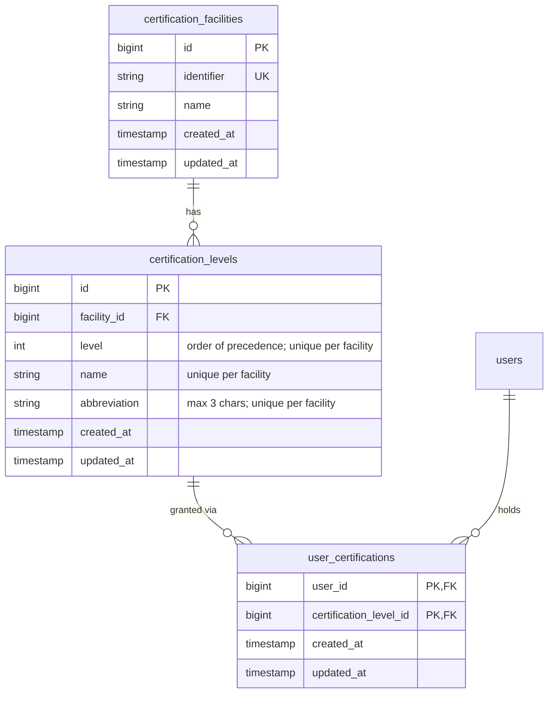

# Certifications

## Purpose

The certification system lets the Facilities department describe the ARTCC's
controller certifications and record which certifications each user holds. It has
two layers:

- **Facilities** group related certifications (for example, a TRACON or a set of
  tower positions) and give them a short display identifier.
- **Levels** are the individual certifications inside a facility, ordered by a
  numeric `level` so a higher number means a higher qualification.

Users can then be associated with the levels they have earned, and those
certifications surface on the roster.

## Key concepts

- A **certification facility** (`CertificationFacility`) has a `name` and an
  `identifier`. The identifier is always read back uppercased.
- A **certification level** (`CertificationLevel`) belongs to one facility. It
  has an integer `level` (order of precedence), a `name`, and a 3-character
  `abbreviation`. Within a facility, `level`, `name`, and `abbreviation` are each
  unique.
- A **user certification** (`UserCertification`) is the link table between a user
  and a certification level. Its primary key is the composite of `user_id` and
  `certification_level_id`, so the relationship between users and levels is
  many-to-many.
- Deleting a facility cascades to its levels, and deleting a level cascades to
  the user certifications that reference it (both enforced by foreign keys in the
  migrations).

## Data model

Tables (all plural):

- `certification_facilities`
- `certification_levels`
- `user_certifications`

Notes on the schema:

- `certification_levels` has three composite unique indexes, all scoped to
  `facility_id`: `facility_level_unique` (`facility_id`, `level`),
  `facility_abbreviation_unique` (`facility_id`, `abbreviation`), and
  `facility_name_unique` (`facility_id`, `name`).
- `user_certifications` has **no** `id` column. Its primary key is the composite
  `(user_id, certification_level_id)`, and it carries `created_at` /
  `updated_at` timestamps.

### Eloquent relationships

- `CertificationFacility::certificationLevels()` — `hasMany(CertificationLevel, 'facility_id')`.
- `CertificationLevel::facility()` — `belongsTo(CertificationFacility, 'facility_id')`.
- `UserCertification::user()` — `belongsTo(User, 'user_id')`.
- `UserCertification::certificationLevel()` — `belongsTo(CertificationLevel, ...)`.
- `UserCertification::facility()` — convenience accessor that returns the level's
  facility relationship.
- `User::certifications()` — `hasMany(UserCertification, 'user_id')`.

## Flows

### Define a facility

1. A staff member with the required permission opens
   **Admin → Certification Facilities**
   (`GET /admin/data/certification-facilities`), rendered by
   `CertificationFacilityController@index` via
   `resources/views/certification-facilities/index.blade.php`.
2. They submit the "Add Facility" form (`name`, `identifier`) to
   `POST /admin/data/certification-facilities`.
3. `CertificationFacilityController@store` validates `name`
   (`required|string|max:255`) and `identifier`
   (`required|string|max:10|unique:certification_facilities,identifier`), then
   creates the facility and redirects back to the index with a success message.

Deleting a facility is a `DELETE` to
`/admin/data/certification-facilities/{facility}`
(`CertificationFacilityController@destroy`). The index view guards it with a
JavaScript confirm because the cascade removes all levels and user
certifications for that facility.

### Define levels

1. From the facility index, follow a facility name to its detail page,
   `GET /admin/data/certification-facilities/{facility}`
   (`CertificationFacilityController@show`,
   `resources/views/certification-facilities/show.blade.php`).
2. The page embeds the `CertificationLevelsTable` Livewire component
   (`app/Livewire/CertificationLevelsTable.php`), which eager-loads the
   facility's levels and lists them ordered by `level` descending.
3. The "Add Certification Level" form posts `name`, `abbreviation`, and `level`
   to `POST /admin/data/certification-facilities/{facility}/certification-levels`.
4. `CertificationLevelController@store` validates the input — `level` is
   `required|integer|min:0` and unique for that `facility_id`, `name` is
   `required|string`, and `abbreviation` is `required|string|max:3` — then saves
   a new `CertificationLevel` under the facility and redirects back to the
   facility show page.

The Livewire component listens for `certification-level-saved` and
`certification-level-deleted` events to refresh its list.

### Grant / revoke a user certification

Records in `user_certifications` are the join between a user and a level. See the
gotcha below: at the time of writing there is no admin controller, route, or
Livewire component that writes to this table, so grants/revokes are not wired up
through the UI. The model, migration, and read paths exist; the write path does
not.

### Display on the roster

Certifications are shown on the **roster** (`RosterController@index`,
`resources/views/roster/index.blade.php`), not on the individual user profile
pages. The roster loads every facility as a column header (its `identifier`) and,
for each rostered user, looks up whether they hold a certification in that
facility, rendering the level or an "Uncertified" placeholder.

## Permissions / middleware

The certification facility routes live inside the admin route group and are
gated by two layers of middleware:

- The outer `admin` prefix requires `permission:view dashboard`.
- The `certification-facilities` group additionally requires
  `permission:manage certification facilities`.

The `manage certification facilities` permission is seeded under the
`facilities` group in `database/seeders/PermissionSeeder.php`. The admin navbar
only shows the "Certification Facilities" link when the user has that permission
(`@haspermission('manage certification facilities')`).

### Routes

| Method | URI | Name | Controller action |
| --- | --- | --- | --- |
| GET | `/admin/data/certification-facilities` | `certification-facilities.index` | `CertificationFacilityController@index` |
| POST | `/admin/data/certification-facilities` | `certification-facilities.store` | `CertificationFacilityController@store` |
| GET | `/admin/data/certification-facilities/{facility}` | `certification-facilities.show` | `CertificationFacilityController@show` |
| DELETE | `/admin/data/certification-facilities/{facility}` | `certification-facilities.destroy` | `CertificationFacilityController@destroy` |
| POST | `/admin/data/certification-facilities/{facility}/certification-levels` | `certification-levels.store` | `CertificationLevelController@store` |

## Key files

| File | Role |
| --- | --- |
| `app/Models/CertificationFacility.php` | Facility model; uppercases `identifier`; `hasMany` levels. |
| `app/Models/CertificationLevel.php` | Level model; `belongsTo` a facility via `facility_id`. |
| `app/Models/UserCertification.php` | User↔level join model with composite PK. |
| `app/Models/User.php` | `certifications()` relation to `UserCertification`. |
| `app/Http/Controllers/CertificationFacilityController.php` | Facility index/show/store/destroy. |
| `app/Http/Controllers/CertificationLevelController.php` | Level creation. |
| `app/Livewire/CertificationLevelsTable.php` | Lists a facility's levels; refreshes on save/delete events. |
| `app/Http/Controllers/RosterController.php` | Loads users and facilities for the roster. |
| `resources/views/certification-facilities/index.blade.php` | Facility list + add form. |
| `resources/views/certification-facilities/show.blade.php` | Facility detail + add-level form. |
| `resources/views/livewire/certification-levels-table.blade.php` | Level table markup. |
| `resources/views/roster/index.blade.php` | Renders certifications on the roster. |
| `database/migrations/2026_01_12_145256_add_certification_facilities.php` | `certification_facilities` table. |
| `database/migrations/2026_01_12_145408_add_certification_levels.php` | `certification_levels` table + unique indexes. |
| `database/migrations/2026_01_12_145724_user_certifications.php` | `user_certifications` join table. |
| `database/seeders/PermissionSeeder.php` | Seeds `manage certification facilities`. |

## Gotchas

- **Table names are plural.** Use `certification_facilities`,
  `certification_levels`, and `user_certifications`. Migrations, validation
  rules, and foreign key constraints all rely on the plural names.
- **`user_certifications` is a composite-key join table.** It has no `id`
  column; the primary key is `(user_id, certification_level_id)`. A user may hold
  many levels and a level may be held by many users — it is many-to-many, not
  one-to-one.
- **Cascading deletes are wide.** Deleting a facility removes its levels, and
  deleting a level removes the matching `user_certifications` rows. The delete
  button on the facility index warns about this; treat facility deletion as
  destructive.
- **Uniqueness is per facility.** `level`, `name`, and `abbreviation` are unique
  only within a facility, so two facilities can reuse the same abbreviation.
- **`abbreviation` is capped at 3 characters** by both the validation rule and
  the form input's `maxlength`.
