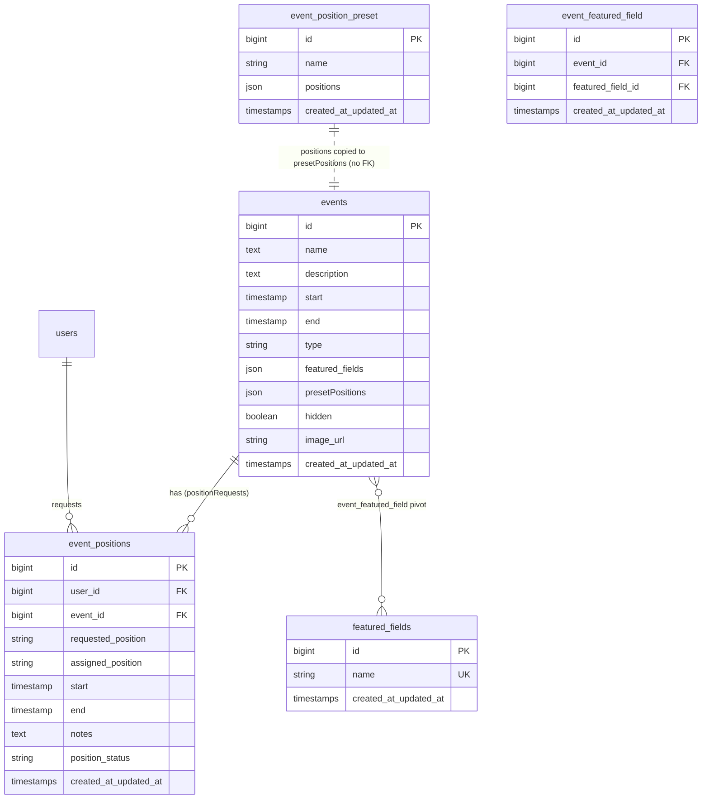

# Events System

This document explains how events work on the ZJX ARTCC site: how staff create and manage events, how reusable position presets and featured-field metadata are attached to them, and how members register for a position on an event.

## Purpose

An **event** is a scheduled VATSIM activity (for example a Friday Night Operations session or a group flight) that members can staff. The events system covers three concerns:

1. **Event management** — staff in the Events department create, edit, and delete events from the admin area.
2. **Reusable metadata** — two catalogs, *position presets* (named lists of ATC positions) and *featured fields* (named airport/ICAO tags), that can be reused across events.
3. **Registration** — authenticated members request a position on a published event, choosing a start/end window and leaving optional notes.

## Key concepts

- **Event** (`app/Models/Event.php`) — the core record. Carries a name, description, `start`/`end` timestamps, a `type`, an optional `image_url`, an array of `featured_fields`, and an array of `presetPositions` (the positions copied from a preset at creation time).
- **Event type** (`app/Enums/EventType.php`) — a string-backed enum cast on the `type` column. Cases:
  - `HOME`
  - `SUPPORT_REQUIRED`
  - `SUPPORT_OPTIONAL`
  - `GROUP_FLIGHT`
  - `FRIDAY_NIGHT_OPERATIONS`
  - `SATURDAY_NIGHT_OPERATIONS`
  - `TRAINING`
- **Featured field** (`app/Models/FeaturedField.php`) — a named tag (typically an airport ICAO such as `KMCO`) stored in the `featured_fields` table. Used as a picklist when creating/editing events.
- **Position preset** (`app/Models/EventPositionPreset.php`) — a named, reusable list of ATC positions stored as JSON in the `event_position_preset` table. When an event is created you may pick a preset by name; its positions are copied onto the event's `presetPositions` column.
- **Event position / registration** (`app/Models/EventPosition.php`) — one row in `event_positions` per member per event, holding the `requested_position`, an optional `assigned_position`, the requested `start`/`end` window, `notes`, and a `position_status` (defaults to `pending`). A unique constraint on `(user_id, event_id)` allows only one registration per member per event.

## Data model

Notes on the schema:

- `event_positions` has a unique index on `(user_id, event_id)` and cascade-deletes when its parent `user` or `event` is deleted. `position_status` defaults to `pending` at the database level.
- `event_position_preset` is singular (set via `$table` on the model). Its `positions` column is JSON and cast to an array.
- `featured_fields.name` is unique. The `event_featured_field` pivot has a unique index on `(event_id, featured_field_id)` and cascade-deletes with either parent.
- The events table has been reshaped across many migrations; the effective columns are those in the model's `$fillable`/`$casts` above. `featured_fields` and `presetPositions` are JSON columns cast to arrays, and `start`/`end` are cast to `datetime`.

## Flows

### Create an event

1. Staff open `GET /admin/events/create` → `EventController::create()`, which renders `manage-events/create.blade.php`. The controller passes `EventType::cases()`, the featured-field names (`FeaturedField::orderBy('name')->pluck('name')`), and the preset names (`EventPositionPreset::orderBy('name')->pluck('name')`) into the view.
2. The form POSTs to `POST /admin/events` → `EventController::store()`. Validation requires `name`, `description`, `start`, `end`, `type` (validated against `EventType`), and `featured_fields` (a string); `image_url` and `presetPositions` are optional.
3. `store()` looks up the chosen preset by name (`EventPositionPreset::where('name', $presetName)->first()`) and copies its `positions` array onto the event's `presetPositions`. The `featured_fields` string is split on `, ` and trimmed into an array.
4. The event is created and the user is redirected to `admin.events.index` (`EventController::manage()`, view `manage-events/index.blade.php`).

Editing (`EventController::edit()` / `update()`) works similarly, but `update()` validates `featured_fields` as an array whose values must be in the known featured-field names.

### Manage the featured-field and preset catalogs

- **Position presets** are a full resource under `EventPositionPresetController` (`admin.events.position-presets.*`). `store()`/`update()` take a comma-separated `positions` string, split and trim it, and save it as the JSON `positions` array. `PositionPresetTable` (Livewire) lists presets in the admin table view.
- **Featured fields** are exposed through `EventFieldController`, but only `index()` is implemented (renders `event-fields/index.blade.php`); the other resource actions have no controller methods.

### A member requests a position

1. A logged-in member views a published event at `GET /events/{event}` → `EventController::show()` (view `events/show.blade.php`), which embeds the `event-registration` Livewire component.
2. `EventRegistration::mount()` loads the event's `presetPositions` as the selectable position list and, if the member already has an `event_positions` row for this event, pre-fills the form and marks it submitted.
3. On submit, the form POSTs to `POST /events/{event}/request-position` (route `events.request-position.store`, wired directly to `EventRegistration::store`, `auth` middleware). `store()` validates the selected position, optional notes (max 500), and a start/end window constrained to fall within the event's `start`/`end`, then creates an `event_positions` row for the current user with `position_status` defaulting to `pending`.
4. A member can withdraw via `EventRegistration::destroy()`, which deletes their `event_positions` row.

### Staff assign positions

The `assigned_position` and `position_status` columns exist to let staff assign and approve requests. See the discrepancies section — the intended staff-assignment path is not fully wired.

## Permissions & middleware

- **Public routes** (no auth): `GET /events` (`events.index`) and `GET /events/{event}` (`events.show`).
- **Registration**: `POST /events/{event}/request-position` (`events.request-position.store`) requires `auth`.
- **Admin / management**: all event management lives under the `admin` prefix, which requires `permission:view dashboard`. The Events department group additionally requires `permission:manage events` and contains:
  - `event-fields` resource → `admin.events.event-fields.*`
  - `position-presets` resource → `admin.events.position-presets.*`
  - `GET /admin/events` → `admin.events.index`
  - `GET /admin/events/create` → `admin.events.create`
  - `POST /admin/events` → `admin.events.store`
  - `GET /admin/events/{event}/edit` → `admin.events.edit`
  - `PUT /admin/events/{event}` → `admin.events.update`
  - `DELETE /admin/events/{event}` → `admin.events.destroy`

Permissions are provided by `spatie/laravel-permission`; see `docs/authentication-authorization.md`.

## Key files

| Concern | File |
| --- | --- |
| Event CRUD controller | `app/Http/Controllers/EventController.php` |
| Featured-field controller (index only) | `app/Http/Controllers/EventFieldController.php` |
| Position-preset resource controller | `app/Http/Controllers/EventPositionPresetController.php` |
| Position-assignment controller | `app/Http/Controllers/EventPositionAssignmentController.php` |
| Event model | `app/Models/Event.php` |
| Event position / registration model | `app/Models/EventPosition.php` |
| Position preset model | `app/Models/EventPositionPreset.php` |
| Featured field model | `app/Models/FeaturedField.php` |
| Event type enum | `app/Enums/EventType.php` |
| Registration UI (Livewire) | `app/Livewire/EventRegistration.php` |
| Admin events table (Livewire) | `app/Livewire/EventTable.php` |
| Preset table (Livewire) | `app/Livewire/PositionPresetTable.php` |
| Create-event component (Livewire) | `app/Livewire/CreateEvent.php` |
| Routes | `routes/web.php` |
| Public event views | `resources/views/events/` |
| Admin event views | `resources/views/manage-events/` |
| Preset views | `resources/views/position-presets/` |
| Featured-field view | `resources/views/event-fields/` |
| Events migrations | `database/migrations/*event*` |

## Gotchas

- **Featured fields are stored two different ways.** Events persist their featured fields as a JSON array on the `events.featured_fields` column (populated from a comma-separated string in the create/edit forms). The `featured_fields` table, the `FeaturedField` model, and the `event_featured_field` pivot exist, but the `Event` model does not define a relationship to them — the many-to-many pivot is not used by the event-creation path. The catalog table is only read to build the featured-field picklist.
- **Presets are copied, not linked.** When an event is created, the selected preset's positions are copied into `events.presetPositions`. There is no foreign key between an event and its preset; editing a preset later does not change events already created from it.
- **`start`/`end` are required on registration and bounded by the event window.** Registration validation forces the requested window to fall inside the event's `start`/`end`.
- **Only one registration per member per event.** Enforced by the unique `(user_id, event_id)` index on `event_positions`; a second `create()` for the same pair will fail at the database level.
