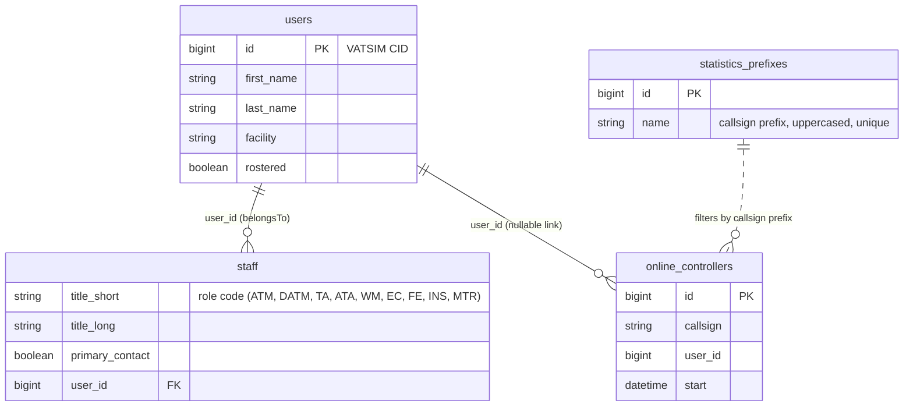

# Roster & Membership System

## Purpose

This system covers who belongs to the ZJX ARTCC and how that membership is
surfaced to the public and to staff:

- The **public roster** — every rostered controller and their certifications.
- **Roster/membership sync from VATUSA** — the authoritative, scheduled job that
  rebuilds the roster and staff assignments from VATUSA.
- The **staff directory** — the public "who's who" of ARTCC leadership and teams.
- The **online controllers widget** — a live list of ZJX controllers currently
  connected to the VATSIM network, shown on the homepage.
- **Statistics prefixes** — the admin-managed list of callsign prefixes used to
  decide which online controllers count as "ZJX".

The full detail of how the site talks to VATUSA (the `SyncRoster` job, the VATSIM
datafeed, `User::createFromVatusa` / `User::updateFromVatusa`, and the DTOs) lives
in [../vatsim-integration.md](../vatsim-integration.md). This document references
that integration where relevant rather than duplicating it.

## Key concepts

- **Roster membership** is a boolean flag (`users.rostered`) on the `User` model,
  not a separate table. A controller is "on the roster" when `rostered = true`.
- **VATUSA is the source of truth.** The sync is **destructive**: on each run it
  clears roster flags and staff assignments and rebuilds them from what VATUSA
  returns. Anything not reflected in VATUSA is dropped. Do not hand-edit roster
  or staff state and expect it to survive the next sync.
- **Visitors** are rostered users whose home `facility` is not the configured
  VATUSA facility. The roster page tags them with a "Visitor" badge.
- **Staff** are stored in a separate `staff` table keyed by a role code
  (`title_short`, e.g. `ATM`, `INS`). A staff row can point at a user who is **not
  in the `users` table** (out-of-division staff, such as the ATM), so the `Staff`
  model's `belongsTo(User)` relation can resolve to `null` — Blade code guards for
  this. See the Gotchas.
- **Online controllers** are a transient cache: the `online_controllers` table is
  truncated and rebuilt every minute from the VATSIM datafeed, filtered by the
  configured **statistics prefixes**.

## Data model

Roster membership itself lives on `users` (see the users/auth documentation for
the full `User` schema). The tables owned by this system are `staff`,
`online_controllers`, and `statistics_prefixes`.

Notes on the schema:

- `staff` has no `id`/timestamps. The `Staff` model declares `title_short` as its
  primary key (`$keyType = 'string'`, `$timestamps = false`), but many rows share
  the same `title_short` (e.g. multiple `INS`, `MTR`, `ATA`). See Gotchas.
- `online_controllers.user_id` is a `foreignId` column but is **not** constrained
  to `users`; a controller can be online without a matching local user row.
- `statistics_prefixes.name` is unique and is always stored/read uppercased via a
  model accessor + mutator.

## Flows

### Public roster page (`GET /roster`)

`RosterController@index` (`app/Http/Controllers/RosterController.php`):

1. Loads all users where `rostered = true`, ordered by `last_name`.
2. Loads all `CertificationFacility` records to build the certification columns.
3. Renders `resources/views/roster/index.blade.php`.

The view renders a table with one row per rostered user: CID (linking to the
user profile), `last_name, first_name`, mapped rating, and one certification
column per facility. If the user's `facility` differs (case-insensitively) from
`env('VATUSA_FACILITY')`, a red "{facility} Visitor" badge is shown. Each
certification cell shows the user's certification level identifier for that
facility, or "Uncertified".

There is no server-side filtering or pagination — the page renders the full
rostered set.

### Roster/membership sync from VATUSA (background)

Handled by the `SyncRoster` job (`app/Jobs/SyncRoster.php`), scheduled every two
hours. At a high level it:

1. **Updates the roster:** fetches the VATUSA roster, sets `rostered = false` on
   all currently-rostered users, then re-applies membership via
   `User::updateFromVatusa` for everyone in the VATUSA response. Users left
   unrostered have their operating initials cleared.
2. **Rebuilds staff:** clears all Spatie roles from every user, **truncates the
   `staff` table**, fetches VATUSA facility info, and repopulates `staff` via
   `Staff::fromFacilityInfoDTO`, then re-assigns roles from the rebuilt staff rows.

Because step 2 truncates and rebuilds, staff assignments are fully derived from
VATUSA on each run. `Staff::fromFacilityInfoDTO` will call
`User::createFromVatusa` for any staff CID not already present locally, which is
how out-of-division staff end up with a `Staff` row but possibly a thin/absent
local user.

For the full mechanics of the sync — endpoints, DTOs, the destructive semantics,
and `User::createFromVatusa` / `updateFromVatusa` — see
[../vatsim-integration.md](../vatsim-integration.md).

### Staff directory (`GET /staff`)

`StaffController@index` (`app/Http/Controllers/StaffController.php`) runs a fixed
set of queries against `staff` to populate named leadership slots and team lists:

| Variable | Query |
| --- | --- |
| `atm` | `title_short = ATM` (first) |
| `datm` | `title_short = DATM`, `primary_contact = true` (first) |
| `ta` | `title_short = TA`, `primary_contact = true` (first) |
| `ec` | `title_short = EC`, `primary_contact = true` (first) |
| `fe` | `title_short = FE`, `primary_contact = true` (first) |
| `wm` | `title_short = WM`, `primary_contact = true` (first) |
| `webTeam` | `title_short = WM`, `primary_contact = false` |
| `eventsTeam` | `title_short = EC`, `primary_contact = false` |
| `facilitiesTeam` | `title_short = FE`, `primary_contact = false` |
| `trainingTeam` | `title_short = ATA` |
| `mentors` | `title_short = MTR` |
| `instructors` | `title_short = INS` |

`resources/views/staff/index.blade.php` lays these out in a grid of
`<x-staff-card>` components (one per leadership position), each optionally
containing an `<x-assistant-staff>` block for that department's non-primary team,
plus a final "Training Team" card listing instructors and mentors.

- **`x-staff-card`** (`resources/views/components/staff-card.blade.php`): takes
  `position`, `description`, `reportsTo`, and a `staff` model. If `staff` is
  `null` it renders "Vacant"; otherwise it links to the user's profile and shows
  their name and rating. Renders its slot (used for the assistant block).
- **`x-assistant-staff`** (`resources/views/components/assistant-staff.blade.php`):
  takes `positionTitle` and a `staff` collection; renders a profile link per
  member, or nothing if the collection is empty.

The `primary_contact` flag distinguishes the single department head (WM/EC/FE)
from that department's assistants. For WM/EC/FE, `Staff::fromFacilityInfoDTO` sets
`primary_contact = true` only for the CID VATUSA reports as the named head
(`wmId` / `ecId` / `feId`).

### Online controllers widget

- **Job:** `UpdateOnlineControllers` (`app/Jobs/UpdateOnlineControllers.php`),
  scheduled every minute. It fetches `{vatsim_api_url}/v2/atc/online`, loads the
  list of statistics prefixes, **truncates `online_controllers`**, and inserts a
  row for each returned controller whose `callsign` starts with any configured
  prefix (via `Str::startsWith`). Each row is built from an `OnlineControllerDTO`.
- **DTO:** `OnlineControllerDTO` (`app/DTOs/OnlineControllerDTO.php`) is a readonly
  value object with `id` (CID), `callsign`, and `start` (a `DateTime`).
- **Model:** `OnlineController` (`app/Models/OnlineController.php`) is timestamp-less
  and exposes `fromDTO()` plus a `user()` relation to resolve the CID to a local
  user (may be absent).
- **Display:** `HomeController@index` passes `OnlineController::all()` to the
  homepage as `onlineSessions`. `resources/views/home.blade.php` renders each with
  `<x-online-controller>` (`app/View/Components/OnlineController.php` +
  `resources/views/components/online-controller.blade.php`), showing the callsign,
  the linked user (or "Unknown User - {cid}" when no local user), the profile
  image, and elapsed connection time.

For datafeed detail see [../vatsim-integration.md](../vatsim-integration.md).

### Statistics prefixes admin

`StatisticsPrefixesController` (`app/Http/Controllers/StatisticsPrefixesController.php`)
provides a small CRUD surface at `/admin/data/statistics-prefixes`:

- `index` — lists all prefixes (sorted by name) in
  `resources/views/statistics-prefixes/index.blade.php`.
- `store` — validates `name` (`required|max:5|min:2`), `firstOrCreate`s it,
  writes an audit log line, and redirects back with a success message.
- `destroy` — deletes by id, writes an audit log line, redirects back.

These prefixes are the filter used by `UpdateOnlineControllers` to decide which
online controllers belong to ZJX. The initial set is seeded by
`StatisticsPrefixesSeeder` (`database/seeders/StatisticsPrefixesSeeder.php`):
`JAX, ZJX, MCO, DAB, TLH, PNS, CHS, LCQ, ORL, SFB, TIX, ISM, LEE, VQQ, NIP`.

## Permissions / middleware

| Route | Path | Middleware |
| --- | --- | --- |
| `roster.index` | `GET /roster` | none (public) |
| `staff.index` | `GET /staff` | none (public) |
| `statistics-prefixes.*` (resource) | `/admin/data/statistics-prefixes` | `permission:view dashboard` (outer `admin` group) + `permission:manage statistics prefixes` |

The `manage statistics prefixes` permission is granted to the `facilities` role in
`database/seeders/PermissionSeeder.php`. The roster and staff pages have no auth
requirement — they are intended to be public.

## Background jobs & mail involved

| Job | Schedule (`routes/console.php`) | Role |
| --- | --- | --- |
| `SyncRoster` | `everyTwoHours()` | Destructively rebuilds roster membership and the staff directory from VATUSA. `ShouldBeUnique`. |
| `UpdateOnlineControllers` | `everyMinute()` | Truncates and rebuilds `online_controllers` from the VATSIM datafeed, filtered by statistics prefixes. |

Both jobs can also be dispatched manually in `local`/`development` via the dev-only
`GET /sync` route (`routes/web.php`). No mail is sent by this system.

## Key files

| Path | Role |
| --- | --- |
| `app/Http/Controllers/RosterController.php` | Public roster page controller. |
| `resources/views/roster/index.blade.php` | Roster table (users, ratings, certifications, visitor badge). |
| `app/Http/Controllers/StaffController.php` | Builds the staff directory from `staff` rows. |
| `app/Models/Staff.php` | Staff model (PK `title_short`); `belongsTo(User)`; `fromFacilityInfoDTO()`. |
| `resources/views/staff/index.blade.php` | Staff directory layout. |
| `resources/views/components/staff-card.blade.php` | Single staff position card (or "Vacant"). |
| `resources/views/components/assistant-staff.blade.php` | Department assistants sub-list. |
| `app/Jobs/SyncRoster.php` | Scheduled VATUSA roster + staff rebuild. |
| `app/Models/OnlineController.php` | Online-controller model + `fromDTO()`. |
| `app/Jobs/UpdateOnlineControllers.php` | Rebuilds online controllers each minute. |
| `app/DTOs/OnlineControllerDTO.php` | Datafeed row DTO (cid, callsign, start). |
| `app/View/Components/OnlineController.php` | View component backing the widget. |
| `resources/views/components/online-controller.blade.php` | Online controller card markup. |
| `resources/views/home.blade.php` | Renders the online controllers widget. |
| `app/Http/Controllers/StatisticsPrefixesController.php` | CRUD for callsign prefixes. |
| `app/Models/StatisticsPrefixes.php` | Prefix model (uppercasing accessor/mutator, activity log). |
| `resources/views/statistics-prefixes/index.blade.php` | Prefix management UI. |
| `database/seeders/StatisticsPrefixesSeeder.php` | Seeds the default ZJX prefixes. |
| `routes/console.php` | Schedules both background jobs. |

## Gotchas

- **The sync is destructive and VATUSA wins.** `SyncRoster` flips all
  `rostered` flags off before re-applying them and **truncates the entire `staff`
  table** on every run. Never treat manual edits to `rostered` or `staff` as
  durable.
- **`online_controllers` is truncated every minute.** It is a cache, not a
  history. Don't build features that assume rows persist between datafeed pulls,
  and don't foreign-key against it.
- **Staff users can be missing locally.** A `Staff` row may reference an
  out-of-division CID. `Staff::fromFacilityInfoDTO` tries to backfill via
  `User::createFromVatusa`, but Blade staff views still access `$staff->user->...`
  directly — a null user will error. The staff card handles a null *staff* (shows
  "Vacant") but not a null *user* on a present staff row.
- **Online-controller users may be unknown.** The widget explicitly renders
  "Unknown User - {cid}" when there is no local user, because the datafeed
  includes controllers with no ZJX account.
- **`Staff` primary key vs. real data.** The model declares `title_short` as its
  primary key, yet the table legitimately holds multiple rows with the same
  `title_short` (e.g. every instructor is `INS`). Queries use `where(...)`, so this
  works in practice, but operations that assume a unique PK (e.g. `find()`,
  keying by the model key) are unreliable here.
- **Statistics prefix length limit.** `store` validates `name` as
  `max:5|min:2`; prefixes must be 2–5 characters. Values are force-uppercased on
  both write and read.
- **Visitor badge uses `env()` directly.** The roster view compares the user
  facility to `env('VATUSA_FACILITY')` rather than a config value; with config
  caching this env read may be unavailable.
