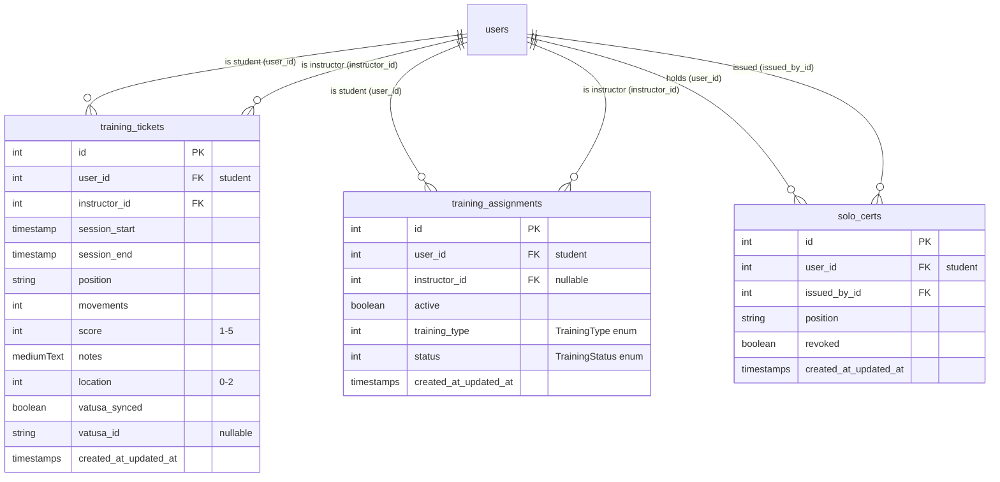

# Training system

The training system covers three related record types that a facility's training
department uses to move a student through their controller certifications:

- **Training tickets** — a written record of a single training session, pushed to
  VATUSA as an official training record.
- **Training assignments** — the link between a student and an instructor for an
  ongoing course (S1, S2, ..., or an Orlando/MCO endorsement).
- **Solo certifications** — a temporary authorization letting a student control a
  position solo before they are fully certified, mirrored to VATUSA.

All three live under `app/Http/Controllers/Training/`, share the `role:training`
admin routes, and hand off to VATUSA through queued jobs. For the detail of the
VATUSA HTTP API those jobs call, see [docs/vatsim-integration.md](../vatsim-integration.md).

---

## Purpose

Give the training department a place to:

- Log each training session and have it appear on the student's VATUSA training
  record automatically.
- Track who is training whom, let instructors claim/drop students, and let the
  training staff move an assignment through its lifecycle (active → mock OTS →
  checkout → complete, etc.).
- Issue and revoke 30-day solo certifications, keeping VATUSA in sync both ways.

---

## Key concepts

- **Student vs. instructor.** Every record links two users: the `user_id`
  (student) and an `instructor_id`. On an assignment the `instructor_id` is
  nullable — an unclaimed request has no instructor yet.
- **Position string.** Tickets and solo certs both store a `position` validated
  against the regex `^([A-Z]{2,3})(_([A-Z]{1,3}))?_(DEL|GND|TWR|APP|DEP|CTR)$`
  (e.g. `JAX_CTR`, `MCO_TWR`, `ORL_GND`).
- **Training type** (`app/Enums/TrainingType.php`) — the course a student is
  enrolled in on an assignment.
- **Training status** (`app/Enums/TrainingStatus.php`) — where an assignment sits
  in its lifecycle.
- **VATUSA sync.** Tickets and solo certs are the two record types mirrored to
  VATUSA. Assignments are internal to the site (they only fire a Discord webhook
  and email).
- **Roles.** The training department uses two Spatie roles: `training`
  (day-to-day training staff) and `instructor` (senior staff with revoke /
  manage powers). See [Permissions & middleware](#permissions--middleware).

### Enum: `TrainingType` (int-backed)

| Case | Value | `mapToString()` |
|------|-------|-----------------|
| `S1` | 1 | `S1` |
| `S2` | 2 | `S2` |
| `S3` | 3 | `S3` |
| `C1` | 4 | `C1` |
| `MCO_GND` | 5 | `MCO GND` |
| `MCO_TWR` | 6 | `MCO TWR` |
| `MCO_APP` | 7 | `F11 TRACON` |

The `MCO_*` cases are the Orlando (KMCO) local endorsements. Note that
`MCO_APP` renders as `F11 TRACON` (the Central Florida TRACON), not "MCO APP".

### Enum: `TrainingStatus` (int-backed)

| Case | Value | `label()` |
|------|-------|-----------|
| `ACTIVE` | 1 | `Active` |
| `SOLO` | 2 | `Solo Cert` |
| `MOCK` | 3 | `Mock OTS` |
| `CHECKOUT` | 4 | `Checkout` |
| `COMPLETE` | 5 | `Complete` |
| `FORFEIT` | 6 | `Forfeit` |

---

## Data model

Three tables, all foreign-keyed to `users`.

### `TrainingTicket` (`app/Models/TrainingTicket.php`)

- Relations: `student()` (→ `user_id`), `instructor()` (→ `instructor_id`).
- `duration` is a computed `Attribute` — it diffs `session_start` and
  `session_end` and returns an `HH:MM` string (falls back to `"00:00"` if the
  dates can't be parsed). There is no `duration` column; it is what the VATUSA
  sync job sends as the record duration.
- `vatusa_synced` (bool) and `vatusa_id` (string, nullable) track sync state.
  `vatusa_id` was added later by `2026_06_11_000001_add_vatusa_id_to_training_tickets_table`.
- Uses Laravel Scout `Searchable` (student/instructor name + id, position, date)
  and Spatie `LogsActivity`.

### `TrainingAssignment` (`app/Models/TrainingAssignment.php`)

- Relations: `student()` (→ `user_id`), `instructor()` (→ `instructor_id`).
- Casts: `active` → bool, `status` → `TrainingStatus`, `training_type` →
  `TrainingType`.
- Has a `status()` mutator that lowercases the incoming value before it is stored.
- Searchable by student name, training type (`mapToString()`), status, date.

### `SoloCert` (`app/Models/SoloCert.php`)

- Relations: `user()` (→ `user_id`), `issuedBy()` (→ `issued_by_id`).
- Casts: `revoked` → bool, timestamps → datetime.
- **Expiry logic:** solo certs are hard-coded to a 30-day life.
  - `expires` = `created_at->addDays(30)`.
  - `expired` = `expires->isBefore(now())`.
  These are computed accessors — there is no `expires`/`expired` column, and the
  30 days is not configurable. The migration comment ("auto expires in 30 days")
  refers to this model logic, not a DB default.

---

## Flows

### Create a training ticket

`TrainingTicketController@store` (`POST /admin/training/tickets`):

1. Validates `student`, `position` (regex above), `location` (0–2),
   `sessionStart`/`sessionEnd` (`sessionEnd` must be after `sessionStart`),
   `movements`, `score` (1–5), `notes`.
2. Rejects the ticket if the instructor picks themselves as the student.
3. Creates the `TrainingTicket` with `instructor_id = Auth::user()->id`.
4. Emails the student (bcc the instructor) via `TrainingTicketCreated`.
5. Dispatches `SyncTrainingTickets` to push to VATUSA.
6. Redirects to `training-tickets.show`.

> The controller's `edit()` / `update()` methods are marked **`!!!! NOT IN USE !!!!`**
> and block edits once `vatusa_synced` is true; `destroy()` is empty.

### Request / create a training assignment (student-initiated, public)

`TrainingAssignmentController@create` (`POST training-assignment/create`, `auth`
only — outside the `role:training` group). Despite the name it *creates* the
record (there is a `TODO: make store` note on the route):

1. Validates `trainingType` (int, required) and confirms it maps to a valid
   `TrainingType`.
2. Rejects if the caller already has an active assignment, or is not `rostered`.
3. Creates the assignment with `instructor_id = null`.
4. Dispatches `SendTrainingRequestToWebhook` (Discord) and emails the requester
   via `TrainingAssignmentCreated`.

### Claim / drop / update / deactivate an assignment (instructor / staff)

- **Claim** — `@claim` (`PUT /admin/training/assignments/claim/{assignment}`):
  requires the `claim students` permission; refuses if the instructor is the
  student, or the assignment is inactive; sets `instructor_id` to the caller and
  emails the student (`TrainingAssignmentUpdated`).
- **Drop** — `@drop` (`PUT /admin/training/assignments/drop/{assignment}`):
  requires `claim students`; refuses on inactive assignments; clears
  `instructor_id` **only if** the caller is the assigned instructor *or* has
  `manage students`; emails the student.
- **Update** — `@update` (`PUT /admin/training/assignments/{assignment}`):
  requires `manage students`; sets `instructor_id`, `active`, `status`,
  `training_type`; emails the student only when `notifyUser` is checked.
- **Deactivate (destroy)** — `@destroy` (`DELETE /admin/training/assignments`,
  id in the request body): allowed if the caller is the student *or* has the
  `deactivate training assignments` permission; sets `active = false` and
  `status = 'withdrawn'`.

`TrainingAssignmentsTable` (`app/Livewire/TrainingAssignmentsTable.php`) is a
Livewire component that lists assignments with a `includeInactive` toggle
(active-only by default), paginated 25/page, newest first.

### Issue a solo certification

`SoloCertController@store` (`POST /admin/training/solo-certs`):

1. Validates `userId` (must exist) and `position` (regex above).
2. Rejects issuing a solo cert to yourself.
3. Creates the `SoloCert` with `issued_by_id = Auth::user()->id`.
4. Flips every active `TrainingAssignment` for that user to `TrainingStatus::SOLO`.
5. Dispatches `CreateVatusaSoloCert`.
6. Emails the student, bcc the issuer and `{vatusa_facility}-ta@vatusa.net`
   (`SoloCertIssued`).

### Revoke a solo certification

`SoloCertController@destroy` (`DELETE /admin/training/solo-certs/{id}`):

1. Requires the `revoke solo certs` permission (aborts 403 otherwise) — this is
   an instructor-only action even though the route sits in the `role:training`
   group.
2. Dispatches `RevokeVatusaSoloCert`.
3. Flips the user's active assignments back to `TrainingStatus::ACTIVE`.
4. Sets `revoked = true`.
5. Emails the student, bcc the issuer and `{vatusa_facility}-ta@vatusa.net`
   (`SoloCertRevoked`).

### VATUSA sync (tickets)

`SyncTrainingTickets` (dispatched on every ticket create, and by the dev-only
`GET /sync-training` route) is a **batch** job — it does not take a ticket
argument. On each run it loads *all* tickets with `vatusa_synced = false` and
POSTs each to
`{vatusa_api_url}/v2/user/{user_id}/training/record`, sending `duration`,
`session_date`, `position`, `movements`, `score`, `notes`, `location`, and the
`instructor_id`. On success it sets `vatusa_synced = true` and records the
returned `vatusa_id` (falling back to a hashed placeholder id if VATUSA's
response shape doesn't include one). Failures are logged and left unsynced for
the next run. See [docs/vatsim-integration.md](../vatsim-integration.md).

---

## Permissions & middleware

All admin training routes are grouped under `/admin` and then
`Route::prefix('/training')->middleware('role:training')` in `routes/web.php`,
so a user needs the Spatie **`training` role** to reach any of them. The one
exception is `training-assignment/create`, which sits outside that group and
only requires `auth` (any logged-in user can request training).

Individual actions layer on finer-grained permission checks
(`hasPermissionTo(...)`). Permissions are seeded in
`database/seeders/PermissionSeeder.php`:

| Role | Permissions (seeded) |
|------|----------------------|
| `training` | `create training tickets`, `edit training tickets`, `claim students`, `issue solo certs` |
| `instructor` | `revoke solo certs`, `manage training tickets`, `manage students` |

Per-action checks:

| Action | Check |
|--------|-------|
| Assignment update | `manage students` |
| Assignment claim | `claim students` |
| Assignment drop | `claim students` (+ must be the assigned instructor unless `manage students`) |
| Assignment destroy | student themselves, or `deactivate training assignments` |
| Solo cert revoke | `revoke solo certs` (403 if missing) |

Ticket create/update and solo cert issue rely on the `role:training` route
guard rather than an in-controller `hasPermissionTo` check.

---

## Background jobs & mail

### Jobs (`app/Jobs/`)

| Job | Trigger | What it does |
|-----|---------|--------------|
| `SyncTrainingTickets` | Ticket create; dev `/sync-training` route | Pushes all unsynced tickets to VATUSA, stamps `vatusa_synced` / `vatusa_id` |
| `SendTrainingRequestToWebhook` | Assignment create | Posts a Discord embed to `training_request_webhook_url` |
| `CreateVatusaSoloCert` | Solo cert issue | `POST {vatusa_api_url}/v2/solo` with cid, position, `expDate` (30 days out) |
| `RevokeVatusaSoloCert` | Solo cert revoke | `DELETE {vatusa_api_url}/v2/solo` with cid + position |

All four are queued (`ShouldQueue`). The VATUSA jobs read
`app.vatusa_api_url` / `app.vatusa_api_key` from config; never hard-code these.

### Mail (`app/Mail/`)

| Mailable | Sent when | Recipients | View |
|----------|-----------|------------|------|
| `TrainingTicketCreated` | Ticket created | student, bcc instructor | `mail.training-ticket-created` |
| `TrainingAssignmentCreated` | Assignment requested | requester | `mail.training-assignment-created` |
| `TrainingAssignmentUpdated` | Assignment claimed / dropped / updated | student, bcc instructor | `mail.training-assignment-updated` |
| `SoloCertIssued` | Solo cert issued | student, bcc issuer + `{facility}-ta@vatusa.net` | `mail.solo-cert-issued` |
| `SoloCertRevoked` | Solo cert revoked | student, bcc issuer + `{facility}-ta@vatusa.net` | `mail.solo-cert-revoked` |

---

## Key files

| File | Role |
|------|------|
| `app/Http/Controllers/Training/TrainingTicketController.php` | Ticket CRUD + sync dispatch |
| `app/Http/Controllers/Training/TrainingAssignmentController.php` | Assignment request / claim / drop / update / destroy |
| `app/Http/Controllers/Training/SoloCertController.php` | Solo cert issue / revoke |
| `app/Models/TrainingTicket.php` | Ticket model, `duration` attribute, sync flags |
| `app/Models/TrainingAssignment.php` | Assignment model, status/type casts |
| `app/Models/SoloCert.php` | Solo cert model, 30-day expiry accessors |
| `app/Livewire/TrainingAssignmentsTable.php` | Assignment list with active/inactive toggle |
| `app/Enums/TrainingType.php` | Course types (incl. `MCO_*`) |
| `app/Enums/TrainingStatus.php` | Assignment lifecycle statuses |
| `app/Jobs/SyncTrainingTickets.php` | Batch push tickets → VATUSA |
| `app/Jobs/SendTrainingRequestToWebhook.php` | Discord notification on request |
| `app/Jobs/CreateVatusaSoloCert.php` | Push solo cert → VATUSA |
| `app/Jobs/RevokeVatusaSoloCert.php` | Revoke solo cert → VATUSA |
| `app/Mail/*` | The five training/solo mailables (table above) |
| `database/seeders/PermissionSeeder.php` | `training` / `instructor` role permissions |
| `routes/web.php` | Route definitions & middleware |

---

## Gotchas

- **`SyncTrainingTickets` is not per-ticket.** It takes no constructor argument
  and re-scans *every* unsynced ticket on each run. Dispatching it after a
  create will also (re)attempt any other tickets still pending.
- **The public "create" assignment route is really a store.** It's a `POST`
  named `training-assignment.create`, guarded only by `auth`, and it writes the
  record directly (there's a `TODO: make store` on it).
- **Ticket edit/update are dead code.** Both are annotated `!!!! NOT IN USE !!!!`
  and `destroy()` is empty — there is currently no supported way to edit or
  delete a ticket through the UI, and synced tickets are blocked from edits
  regardless.
- **Solo cert expiry is fixed at 30 days** and computed on the model; there's no
  column or config to change it. `expDate` sent to VATUSA is derived from the
  same accessor.
- **Assignment `status` values.** The controller sets both enum values
  (`TrainingStatus::SOLO`, `TrainingStatus::ACTIVE`) and a raw string
  (`'withdrawn'` on deactivate), while the model both casts `status` to the
  int-backed `TrainingStatus` enum *and* defines a `status()` mutator that
  lowercases the value. Be careful when reading/writing status directly — the
  cast and the mutator interact, and `'withdrawn'` is not a `TrainingStatus`
  case.
- **VATUSA `vatusa_id` may be a placeholder.** If VATUSA's response doesn't
  expose a record id in any of the shapes the job checks, it stores a truncated
  SHA-1 hash instead of a real VATUSA record id.
