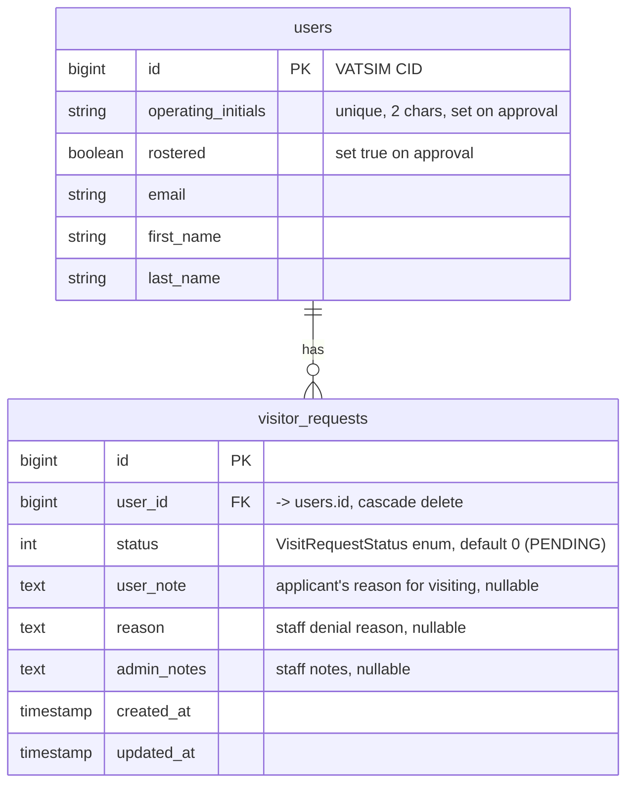
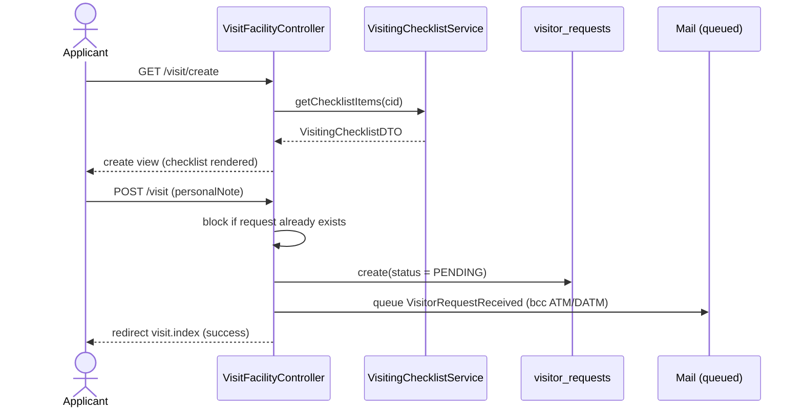
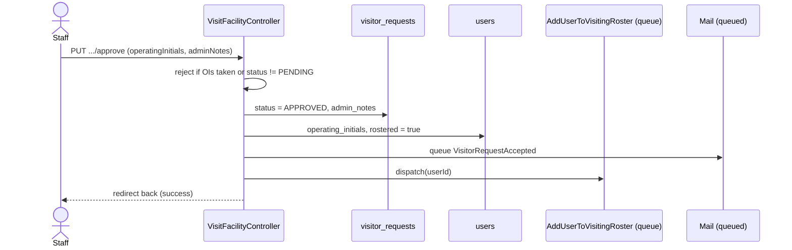

# Visiting Controllers

## Purpose

This system lets controllers who are members of another VATUSA facility apply to
"visit" the Virtual Jacksonville ARTCC (vZJX), and lets vZJX staff review those
applications. When an application is approved, the applicant is assigned operating
initials, marked as rostered locally, and pushed to VATUSA's visiting roster for
the facility.

Everything is driven from a single controller (`VisitFacilityController`), a single
Eloquent model (`VisitorRequest`), and the VATUSA API (both for the eligibility
checklist and for the roster write-back).

## Key concepts

- **Visit request** — a `VisitorRequest` row representing one applicant's
  application. There is effectively one request per user (the apply flow blocks a
  second one).
- **Eligibility checklist** — a read-only snapshot pulled live from VATUSA
  (`/v2/user/{cid}/transfer/checklist`) that tells the applicant whether they meet
  the division's visiting requirements. It is rendered on the apply page but is not
  re-checked server-side on submit.
- **Operating initials (OIs)** — a unique 2-character identifier assigned to the
  controller at approval time. They are stored on the `users` table
  (`operating_initials`), not on the visit request.
- **Rostered** — the local `users.rostered` boolean. Approval sets it to `true`.
  Users who are already rostered cannot apply.
- **VATUSA roster write-back** — on approval, a queued job calls the VATUSA
  `manageVisitor` endpoint so the controller is added to the facility's visiting
  roster upstream. See [VATSIM integration](../vatsim-integration.md).

## Data model

The only table owned by this system is `visitor_requests` (created by
`database/migrations/2026_01_04_221411_add_visitor_requests_table.php`). It links
back to `users`.



Notes on the model (`app/Models/VisitorRequest.php`):

- `$fillable`: `user_id`, `status`, `reason`, `admin_notes`, `user_note`.
- `status` is cast to `App\Enums\VisitRequestStatus`.
- `user()` — `belongsTo(User::class)`.
- Uses Laravel Scout (`Searchable`). `toSearchableArray()` indexes the applicant's
  `name` and the request `reason`. The staff search box (`manage()`) uses
  `VisitorRequest::search(...)`.

### Status enum

`app/Enums/VisitRequestStatus.php` is a backed `int` enum:

| Case       | Value | `label()`  |
|------------|-------|------------|
| `PENDING`  | `0`   | `Pending`  |
| `APPROVED` | `1`   | `Approved` |
| `DENIED`   | `2`   | `Denied`   |

It also exposes `fromInt(int $value)`, which throws `InvalidArgumentException` for
any value outside 0–2.

## Flows

### 1. Apply

Public entry point is `GET /visit` (`visit.index`), which is open to guests. The
landing page (`resources/views/visit/index.blade.php`) explains the process and
shows a context-aware button:

- If the user already has a `VisitorRequest` row → shows a disabled "pending"
  message. `index()` computes `$hasActiveVisitRequest` as
  `VisitorRequest::where('user_id', ...)->exists()` — i.e. any row, of any status,
  counts.
- If logged in and not rostered → link to `visit.create`.
- If logged in and already rostered → disabled "already rostered" message.
- If a guest → link to log in (`auth.redirect`).

`GET /visit/create` (`visit.create`, `auth` middleware) runs the eligibility
checklist and renders the apply form (`resources/views/visit/create.blade.php`).
If the user already has any `VisitorRequest`, `create()` redirects back to
`visit.index` with an error.

`POST /visit` (`visit.store`, `auth` middleware) handles submission:

1. Rejects the submit if a `VisitorRequest` already exists for the user.
2. Validates `personalNote` (`required|string|max:1000`).
3. Creates a `VisitorRequest` with `user_id`, `user_note` = the personal note, and
   `status = PENDING`.
4. Queues a `VisitorRequestReceived` mail to the applicant, BCC'd to
   `atm@zjxartcc.org` and `datm@zjxartcc.org`.
5. Logs the submission and redirects to `visit.index` with a success message.



### 2. Checklist evaluation

`app/Services/VisitingChecklistService::getChecklistItems(string $cid)` calls the
VATUSA API:

```
GET {vatusa_api_url}/v2/user/{cid}/transfer/checklist?apikey={vatusa_api_key}
```

The `$cid` passed by the controller is the authenticated user's id
(`strval(Auth::user()->id)`), which is the VATSIM CID.

- If the response status is not `200`, it returns `new VisitingChecklistDTO(null)`,
  which sets `error = true` and `visitEligible = false`.
- Otherwise it wraps `$response->json()` in a `VisitingChecklistDTO`.

`app/DTOs/VisitingChecklistDTO.php` maps the VATUSA `data` payload onto typed
properties:

| DTO property               | VATUSA `data` key | Meaning                                        |
|----------------------------|-------------------|------------------------------------------------|
| `error`                    | (none)            | `true` when the API call failed / non-VATUSA   |
| `hasHomeFacility`          | `homecontroller`  | Has a home facility                            |
| `needsBasic`               | `needbasic`       | Basic exam / RCE status                        |
| `visitingDays`             | `visitingDays`    | Days visiting (defaults to `0`)                |
| `visitingDaysMet`          | `60days`          | ≥ 60 days since last visiting another facility |
| `ninetyDaysSincePromotion` | `90days`          | ≥ 90 days since promotion                      |
| `fiftyHoursSincePromotion` | `50hrs`           | ≥ 50 hours since last promotion                |
| `visitEligible`            | `visiting`        | VATUSA's overall visiting-eligible flag        |

The apply view (`create.blade.php`) renders these as a checklist and additionally
shows two locally-derived rows: "not a member of vZJX" (`!auth()->user()->rostered`)
and "S3 rating or higher" (`rating >= ControllerRating::S3`). The submit form is
only shown when `$checklist->visitEligible && !auth()->user()->rostered &&
!$checklist->error`. If `$checklist->error` is set, the view tells the user they do
not appear to be a VATUSA member and links to the VATUSA FAQ.

### 3. Staff review, approve, deny

Staff list and detail views live under the admin prefix (see Permissions below):

- `GET /admin/visit-requests` (`visit.manage`) — searchable, paginated list
  (`resources/views/visit/manage.blade.php`), 25 per page.
- `GET /admin/visit-requests/{visitRequest}` (`visit.show`) — detail view
  (`resources/views/visit/show.blade.php`) with the approve / deny form. The form
  embeds the `OperatingInitialsInput` Livewire component and posts to either the
  approve or deny route via per-button `formaction`.

**Approve** — `PUT /admin/visit-requests/{visitRequest}/approve` (`visit.approve`):

1. Validates `operatingInitials` (`required|string|size:2`) and optional
   `adminNotes` (`max:1000`).
2. Rejects if the uppercased OIs are already assigned to any user
   (`User::where('operating_initials', ...)->exists()`).
3. Loads the request; rejects unless it is `PENDING`.
4. Sets `status = APPROVED`, saves `admin_notes`.
5. On the applicant's user record: sets `operating_initials` and `rostered = true`,
   saves.
6. Queues `VisitorRequestAccepted` mail (BCC ATM/DATM).
7. Dispatches `AddUserToVisitingRoster` with the user id.
8. Logs and redirects back with success.

**Deny** — `PUT /admin/visit-requests/{visitRequest}/deny` (`visit.deny`):

1. Validates `reason` (`required|string|max:1000`) and optional `adminNotes`
   (`max:1000`).
2. Loads the request; rejects unless it is `PENDING`.
3. Sets `reason`, `admin_notes`, and `status = DENIED`, saves.
4. Logs and queues `VisitorRequestRejected` mail (BCC ATM/DATM).
5. Redirects back with success.



### 4. VATUSA roster add

`app/Jobs/AddUserToVisitingRoster.php` is a queued job (`ShouldQueue`). Its
`handle()` posts to VATUSA:

```
POST {vatusa_api_url}/v2/facility/{vatusa_facility}/roster/manageVisitor/{userId}
     body: apikey = {vatusa_api_key}
```

On failure it logs an error with the response body; on success it logs an info
message. The job does not retry or revert the local approval if the call fails. See
[VATSIM integration](../vatsim-integration.md) for the shared VATUSA config keys
(`vatusa_api_url`, `vatusa_api_key`, `vatusa_facility`) and API conventions.

### Operating initials input (Livewire)

`app/Livewire/OperatingInitialsInput.php` is used inside the staff detail view. It:

- Takes the `VisitorRequest` on `mount()` and pre-fills `operatingInitials` from the
  applicant's existing `operating_initials` (uppercased).
- Uppercases input on change (`updatedOperatingInitials`) and live-validates.
- `rules()`: `nullable|string|size:2|unique:users,operating_initials,{user_id}`
  (the applicant's own row is excluded from the uniqueness check).
- The input is disabled unless the request is `PENDING`
  (`resources/views/livewire/operating-initials-input.blade.php`).

The component validates for UX, but the authoritative validation and the actual
assignment happen in `VisitFacilityController::approve()`.

## Permissions & middleware

| Route                                          | Name            | Method | Middleware                                                                  |
|------------------------------------------------|-----------------|--------|----------------------------------------------------------------------------|
| `/visit`                                       | `visit.index`   | GET    | none (public)                                                              |
| `/visit/create`                                | `visit.create`  | GET    | `auth`                                                                     |
| `/visit`                                        | `visit.store`   | POST   | `auth`                                                                     |
| `/admin/visit-requests`                        | `visit.manage`  | GET    | `permission:view dashboard` + `permission:manage visiting controllers`     |
| `/admin/visit-requests/{visitRequest}`         | `visit.show`    | GET    | `permission:view dashboard` + `permission:manage visiting controllers`     |
| `/admin/visit-requests/{visitRequest}`         | `visit.update`  | PUT    | `permission:view dashboard` + `permission:manage visiting controllers`     |
| `/admin/visit-requests/{visitRequest}/approve` | `visit.approve` | PUT    | `permission:view dashboard` + `permission:manage visiting controllers`     |
| `/admin/visit-requests/{visitRequest}/deny`    | `visit.deny`    | PUT    | `permission:view dashboard` + `permission:manage visiting controllers`     |

The admin routes live inside the `admin` prefix group gated by
`permission:view dashboard`, with a nested group gated by
`permission:manage visiting controllers` — so both permissions are required.

## Background jobs & mail

| Class                                   | Type       | When it fires                                    | Recipients                                    |
|-----------------------------------------|------------|--------------------------------------------------|-----------------------------------------------|
| `App\Jobs\AddUserToVisitingRoster`      | Queued job | On approval, after local records are updated     | VATUSA `manageVisitor` API                     |
| `App\Mail\VisitorRequestReceived`       | Queued mail| On submit (`store()`)                            | Applicant, BCC `atm@` / `datm@zjxartcc.org`   |
| `App\Mail\VisitorRequestAccepted`       | Queued mail| On approval (`approve()`)                        | Applicant, BCC `atm@` / `datm@zjxartcc.org`   |
| `App\Mail\VisitorRequestRejected`       | Queued mail| On denial (`deny()`)                             | Applicant, BCC `atm@` / `datm@zjxartcc.org`   |

All three mailables carry the `VisitorRequest` and render Blade views under
`resources/views/mail/` (`visitor-request-received`, `visitor-request-accepted`,
`visitor-request-rejected`). The accepted mail surfaces the assigned operating
initials via the `User::operatingInitials` accessor.

## Key files

| File | Role |
|------|------|
| `app/Http/Controllers/VisitFacilityController.php` | All request handling: index, show, manage, create, store, approve, deny |
| `app/Models/VisitorRequest.php` | Eloquent model, Scout searchable, status cast |
| `app/Enums/VisitRequestStatus.php` | `PENDING` / `APPROVED` / `DENIED` backed int enum |
| `app/Services/VisitingChecklistService.php` | Calls VATUSA transfer/checklist endpoint |
| `app/DTOs/VisitingChecklistDTO.php` | Maps the VATUSA checklist payload to typed fields |
| `app/Jobs/AddUserToVisitingRoster.php` | Queued VATUSA roster write-back on approval |
| `app/Livewire/OperatingInitialsInput.php` | OI input + live uniqueness validation in the staff form |
| `app/Mail/VisitorRequestReceived.php` | Submit-confirmation mail |
| `app/Mail/VisitorRequestAccepted.php` | Approval mail |
| `app/Mail/VisitorRequestRejected.php` | Denial mail |
| `resources/views/visit/index.blade.php` | Public landing / entry page |
| `resources/views/visit/create.blade.php` | Eligibility checklist + apply form |
| `resources/views/visit/manage.blade.php` | Staff list of requests |
| `resources/views/visit/show.blade.php` | Staff detail + approve/deny form |
| `resources/views/livewire/operating-initials-input.blade.php` | OI input markup |
| `database/migrations/2026_01_04_221411_add_visitor_requests_table.php` | `visitor_requests` schema |
| `routes/web.php` | `/visit*` and `/admin/visit-requests*` routes |

## Gotchas

- **One request per user, forever.** Both `create()` and `store()` block if the
  user has *any* `VisitorRequest`, and `index()` treats any existing row as an
  "active" request. A user whose request was denied cannot reapply through the UI —
  the row would have to be removed first.
- **Eligibility is not enforced on submit.** The checklist gates the apply *form* in
  the Blade view only. `store()` re-checks nothing except the duplicate guard and
  `personalNote` validation, so a crafted POST could create a request regardless of
  VATUSA eligibility or rating.
- **OI uniqueness is enforced twice, slightly differently.** The Livewire component
  uses a DB `unique` rule excluding the applicant's own row; `approve()` uses a
  plain `exists()` check on the uppercased value. `approve()` stores the raw
  `operatingInitials` value (not explicitly uppercased) on the user, though the
  duplicate check uppercases it first.
- **Approval writes to two places before the VATUSA call.** Local `status`,
  `operating_initials`, and `rostered` are all persisted before
  `AddUserToVisitingRoster` runs. If the VATUSA call later fails, the local state is
  already "approved/rostered" and the job only logs the error — there is no
  automatic reconciliation.
- **Mail and roster writes are queued.** They require a running queue worker; they
  do not execute inline with the HTTP request.
